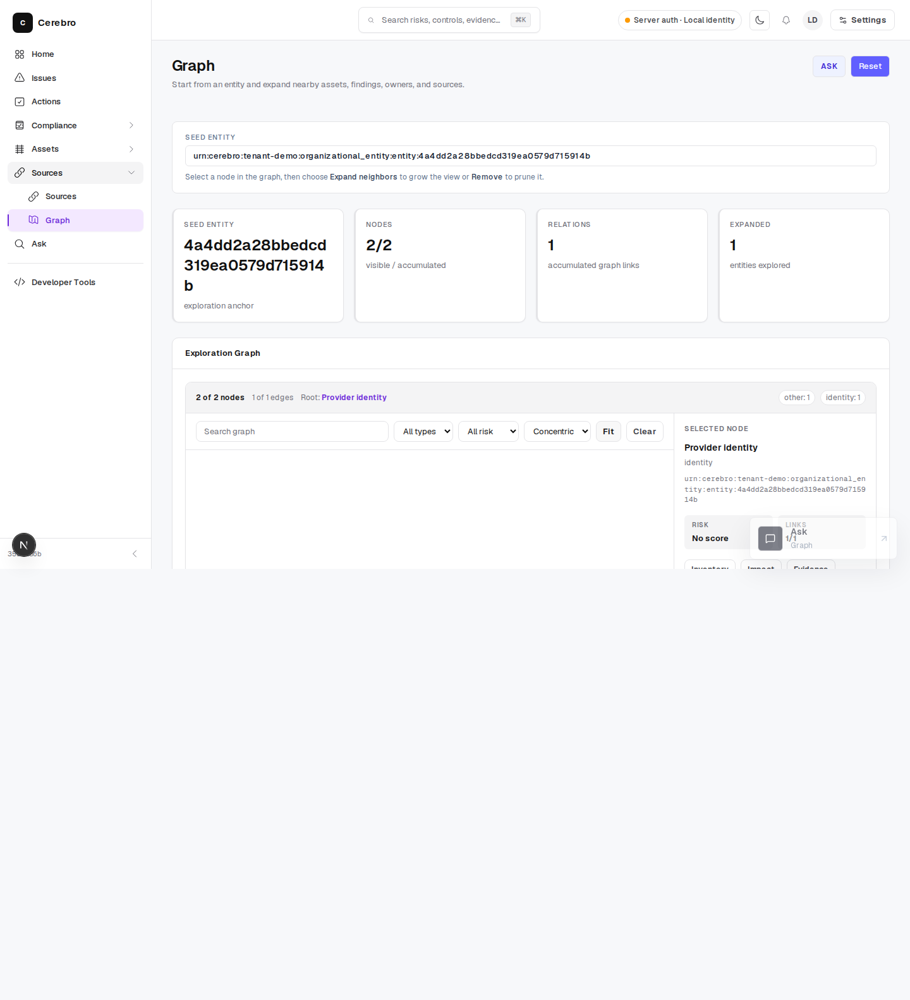
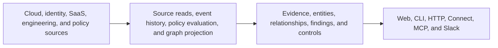

# Cerebro

**Security evidence that people and coding agents can query.**

[](https://go.dev/)
[](LICENSE)

Cerebro reads cloud, identity, SaaS, engineering, policy, and compliance data. It connects that evidence into tenant-scoped entities, relationships, findings, and controls, then exposes the same context through the web, CLI, HTTP, Connect, and MCP.

[Run the product demo](#run-the-product-demo) · [Read a live source](#read-a-live-source) · [Connect an agent](#connect-an-agent) · [Browse the docs](#documentation)



## What You Can Do

- Trace a risky asset or identity to its owner, connected services, findings, and applicable controls.
- Ask what changed and receive the source record, collection time, and graph path supporting the answer.
- Give coding agents current security and compliance context before they propose or ship a change.
- Preview a provider directly, or persist source syncs, events, findings, reports, and graph projections for durable workflows.

Cerebro includes more than 800 built-in source definitions and more than 1,500 policy definitions across cloud, identity, endpoint, vulnerability, engineering, AI, and compliance systems. Source definitions describe cataloged capabilities; required configuration and supported records are listed in the [source catalog](docs/reference/sources.md).

## Run The Product Demo

The shortest path starts the Rust product demo, an in-memory organizational graph and the browser explorer. It uses synthetic product data and requires no Docker services or provider credentials.

Prerequisites: Node.js 22 or newer and the Rust toolchain declared in `rust-toolchain.toml`.

```bash
git clone https://github.com/writer/cerebro.git
cd cerebro
make rust-product-demo
```

Open the graph explorer URL printed in the terminal. Press `Ctrl-C` to stop both processes.

To verify the browser-to-Rust path and write a redacted receipt:

```bash
make rust-product-demo-check
cat tmp/rust-product-demo/receipt.json
```

The receipt records the source revision, graph contract, graph counts, and browser proof. It does not record the ephemeral local authentication secret.

## Read A Live Source

Use the Go compatibility server when you need live provider reads, CLI, HTTP, Connect, MCP, or source-runtime workflows. The public GitHub example does not require the durable data stack.

```bash
make serve-dev
./bin/cerebro source read github owner=writer repo=cerebro per_page=5
```

The same source service is available through the CLI, HTTP API, and MCP tools. Provider-specific authentication and configuration are documented in the [source catalog](docs/reference/sources.md).

## Choose A Runtime

| Goal | Start with | Data and dependencies |
| --- | --- | --- |
| Inspect the product locally | `make rust-product-demo` | Rust product demo; synthetic in-memory graph; Node.js and Rust; no credentials or Docker |
| Read current provider data | `make serve-dev` | Go compatibility runtime; live source preview; provider configuration when the source requires it |
| Persist evidence and findings | `docker compose up -d` | NATS JetStream, Postgres, and Neo4j plus the Go compatibility runtime |

Routes backed by an unconfigured durable store fail closed. No in-memory or SQLite production fallback is used for durable routes. The full local-stack procedure, including volume and password transitions, lives in [Getting started](docs/start/getting-started.md). Runtime profile selection, secret placeholders, and preflight checks are documented in [Runtime profiles](docs/operations/runtime-profiles.md).

## How Cerebro Produces Context



Live source preview calls the source service directly. Durable workflows add NATS JetStream for the append log, Postgres for current state and receipts, and Neo4j/Aura for graph projections. Read [Architecture](docs/reference/architecture.md) for operation-level dependency boundaries.

## Connect An Agent

Start the server, register its MCP endpoint with your client, and ask the agent to read a source before making a decision.

```bash
make serve-dev
droid mcp add cerebro-local http://127.0.0.1:8080/api/v1/mcp --type http \
  --header "Authorization: Bearer <local-dev-key>"
```

Example instruction:

```text
Use Cerebro as security and compliance context for this repository.
Read the GitHub source for the repository, then report the evidence, risks,
applicable controls, owners, and unresolved questions that matter before ship.
Do not expose or commit provider credentials or secret values.
```

The MCP source tools are `cerebro.sources.list`, `cerebro.sources.check`, `cerebro.sources.discover`, and `cerebro.sources.read`. See [Agent onboarding](docs/start/agent-onboarding.md), [MCP setup](docs/domains/mcp-droid-setup.md), and the [agent platform contract](docs/domains/agent-platform-contract.md).

## Product Surfaces

Current authority map:

| Surface | Current role | Required evidence before deleting Go compatibility |
| --- | --- | --- |
| Rust organizational platform | Rust-authoritative tenant-scoped graph routes and invariant-heavy authority paths, including the Rust product demo | Typed graph tests, readiness/fail-closed receipts, product-shape compatibility, rollback evidence |
| Go compatibility runtime | Go compatibility runtime for source reads, CLI, HTTP, Connect, MCP, append-log, findings, reports, and compatibility workflows | Source/runtime parity, durable fencing, rollback receipts, OpenAPI/proto/SDK/MCP compatibility gates |
| Durable evidence stores | NATS JetStream, Postgres, and Neo4j are required for persisted evidence, append-log replay, receipts, findings, reports, graph projection, and graph queries | Preflight, health/readiness, projection and replay receipts; unconfigured routes must fail closed |
| Web app | Browser workflows over public runtime contracts; the local product demo talks to Rust graph demo APIs | Browser demo receipt, console-clean shape compatibility, API compatibility checks |
| Slack companion | Durable intake, execution, delivery, and lifecycle status through explicit Slack authority paths | Fixture-only Slack validation unless live writes are explicitly approved |
| SDKs and schemas | Python, TypeScript, Go, OpenAPI, proto, and portable interchange contracts | Generated artifact drift checks and SDK tests |

Surfaces not listed as Rust-authoritative remain Go-compatible or bridged until their validation gates pass. Do not infer full Rust replacement from the product demo alone.

Top-level commands are `serve`, `version`, `source`, `source-runtime`, `connector-catalog`, `append-log`, `finding-rule`, `graph`, `orchestrator`, `vulndb`, `closeout`, and `deploy`.

The Go compatibility runtime uses the `go1.26.6` toolchain. Run `make doctor` to check the complete Go, Node.js, Rust, and repository toolchain.

## Documentation

| Task | Guide |
| --- | --- |
| Run the shortest local path | [Quick reference](docs/start/quick-reference.md) |
| Read a source and start the durable stack | [Getting started](docs/start/getting-started.md) |
| Configure auth, tenancy, stores, MCP, or device auth | [Configuration variables](docs/reference/config-env-vars.md) and [.env.example](.env.example) |
| Explore APIs | [API reference](docs/reference/api-reference.md), [OpenAPI](api/openapi.yaml), and [Connect proto](proto/cerebro/v1/bootstrap.proto) |
| Use an SDK | [Python SDK](sdk/python/README.md), [TypeScript SDK](sdk/typescript/README.md), and [Go SDK](sdk/go/cerebroapi) |
| Browse integrations | [Source catalog](docs/reference/sources.md) |
| Author policies and controls | [Policies](docs/domains/policies.md) and [compliance controls](docs/domains/compliance-controls.md) |
| Integrate endpoint telemetry | [Endpoint security platform integration](docs/domains/endpoint-security-platform-integration.md) |
| Host or operate Cerebro | [Hosting](docs/operations/hosting.md) and [operations runbook](docs/operations/operations-runbook.md) |
| Contribute | [Development](docs/engineering/development.md) and [non-goals](docs/engineering/non-goals.md) |

## Project Contracts

This public repository is authoritative for runtime behavior, portable application behavior, CLI and API contracts, source catalogs, configuration semantics, validation checks, and release artifacts. Environment-specific deployment details, account wiring, secret addresses, rollout thresholds, and recovery procedures belong to their operational owners outside this repository.

The portable deployment handoff is a signed product manifest and topology-neutral event. Deployment automation verifies the manifest and renders its own `cerebro-runtime-contract.json`. See [Monorepo ownership and boundaries](docs/engineering/monorepo.md) and the [release contract](docs/operations/release-contract.md).

Control extension packs use the workflows documented in [Compliance controls](docs/domains/compliance-controls.md): `--init-extension`, `--extension`, `--profile`, `--output`, and `--write`.

Common validation commands:

```bash
make rust-fmt-check
make rust-clippy
make rust-test
make projection-parity-test
make source-fixture-check
make mcp-contract-check
make mcp-sdk-compat
make openapi-check
make openapi-lint
make sdk-test
make rust-product-demo-check
make graph-rebuild-dryrun RUNTIME_ID=<runtime-id>
make readme-check
make docs-drift-check
make oss-audit
make control-index-check
make policy-rule-check
make detection-catalog-check
make verify
```

## Scope

Cerebro is not a SIEM, SOAR, CSPM replacement, LLM host, or data warehouse. It provides the evidence and contract layer those systems, people, and agents can query. The canonical product and architecture boundaries are maintained in [Non-goals](docs/engineering/non-goals.md).

## License

Apache 2.0; see [LICENSE](LICENSE).
