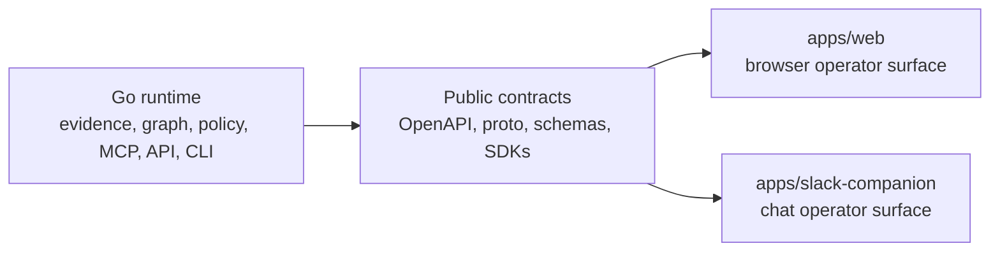
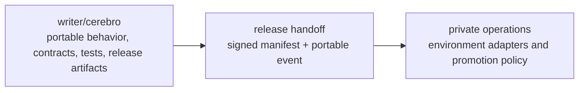
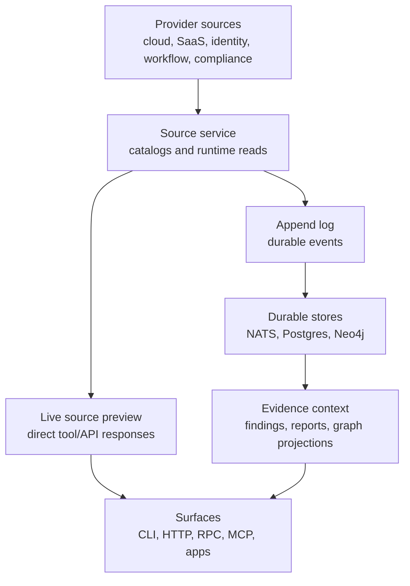
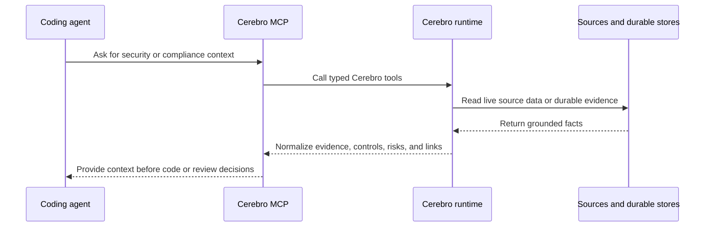
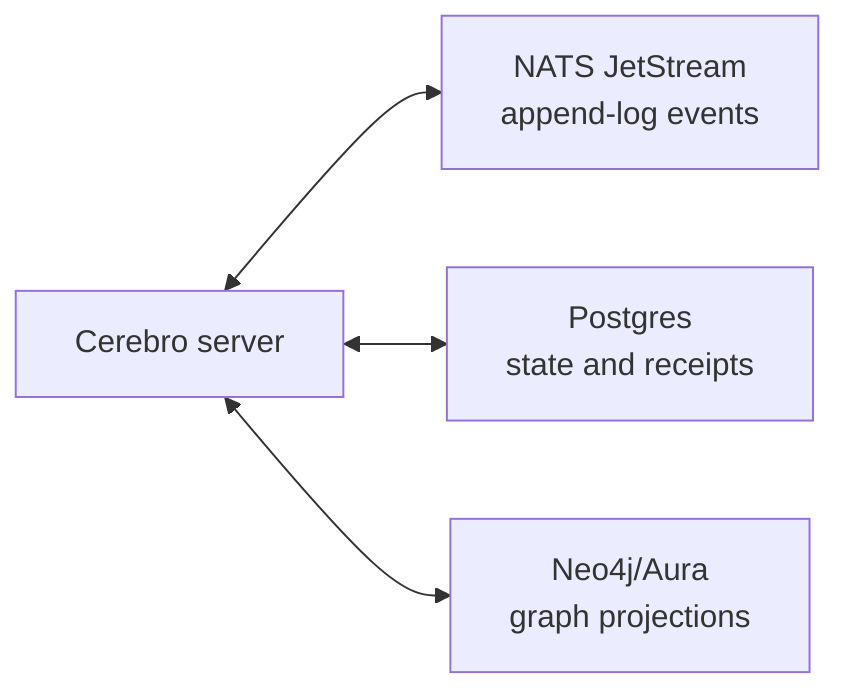

# Cerebro

**Agent-readable security and compliance context.**

[](https://go.dev/)
[](LICENSE)

Cerebro turns security, identity, cloud, SaaS, workflow, policy, and compliance data into evidence-backed context for people, coding agents, and automation. It answers questions such as what changed, what is risky, which controls apply, and whether an action is supported by current evidence.

This repository is a monorepo because Cerebro is one product with several operator surfaces:

- the Go runtime is the source of truth for evidence, graph, policy, findings, MCP, JSON HTTP, Connect RPC, and CLI behavior;
- the web app is a browser operator surface over those contracts;
- the Slack companion is a chat operator surface for durable intake, execution, delivery, and lifecycle status;
- SDKs, generated schemas, and applications can move together when a contract changes.



Cerebro is not a SIEM, SOAR, CSPM replacement, LLM host, or data warehouse. It is the contract and evidence layer that lets those systems, humans, and agents ask grounded questions.

## Why The Public Boundary Matters

This public repository is authoritative for runtime behavior, portable application behavior, CLI/API contracts, source catalogs, configuration semantics, validation checks, and release artifacts. Environment-specific deployment details, stack configuration, account wiring, hostnames, secret addresses, rollout procedures, and recovery procedures intentionally live outside this public repo.

That split is part of the design, not an afterthought. Public code defines portable behavior, contracts, fixtures, and conformance tests. Private operations bind those contracts to real accounts, networks, routes, secrets, rollout thresholds, and recovery policy.



The deployment handoff is the signed product manifest and its topology-neutral consumer event. Deployment automation verifies the manifest, selects its recorded image digests, and renders its own `cerebro-runtime-contract.json` from configuration it owns. See [Monorepo Ownership And Boundaries](docs/engineering/monorepo.md) for ownership rules and [Release Contract](docs/operations/release-contract.md) for the public contracts.

## Runtime Shapes

Cerebro can run in two useful modes:

1. **Live source preview:** run the Go server and call source tools directly. This path can read provider data through the source service without Postgres, NATS, or Neo4j.
2. **Durable evidence runtime:** add NATS JetStream, Postgres, and Neo4j/Aura to persist source runtime syncs, append-log events, findings, reports, and graph projections.

The same source contracts, API contracts, policy catalogs, and validation tools apply in both modes. Routes that require a durable store fail closed when that store is absent.



## Quick Start

```bash
git clone https://github.com/writer/cerebro.git
cd cerebro
make serve-dev
```

The local development server listens on `:8080` by default.

```bash
curl -sS http://127.0.0.1:8080/health
curl -sS http://127.0.0.1:8080/sources
```

Build the CLI when you need command-line workflows:

```bash
make build
./bin/cerebro version
./bin/cerebro source list
```

Use `make doctor` when you want to validate the full contributor toolchain, including npm and Rust workspace tooling.

## Repository Layout

| Area | Paths | Purpose |
| --- | --- | --- |
| Runtime and CLI | `cmd/cerebro`, `internal/bootstrap` | Go server, CLI, HTTP, Connect RPC, MCP, auth, rate-limit, and route wiring. |
| Applications | `apps/web`, `apps/slack-companion` | Portable operator surfaces that consume Cerebro contracts. See [Applications](apps/README.md). |
| Source and evidence contracts | `internal/sourcecdk`, `internal/sourceregistry`, `sources/` | Source contract plus built-in catalog for cloud, SaaS, identity, endpoint, vulnerability, workflow, and compliance signals. |
| Durable workflows | `internal/appendlog`, `internal/sourceprojection`, `internal/findings`, graph packages | Append-log, runtime sync, finding, report, and graph projection behavior. |
| Policies and detections | `policies/`, `internal/findingdsl`, `internal/findings` | Policy, control mapping, finding rule, and detection catalogs. |
| API contracts | `api/openapi.yaml`, `proto/cerebro/v1/bootstrap.proto` | JSON HTTP and Connect RPC contracts. |
| SDK helpers | `sdk/python`, `sdk/typescript`, `sdk/go/cerebroapi` | Generated and hand-written helpers for public API surfaces. |
| DevEx and guardrails | `docs/`, `scripts/`, `tools/` | Operating guides, validation checks, generators, and repository-specific structural tests. |

Applications are peers of the Go runtime, not embedded assets and not deployment overlays. The runtime can build, test, and publish its contracts without serving app bundles, and applications can build against those contracts without carrying private topology.

Top-level commands are `serve`, `version`, `source`, `source-runtime`, `connector-catalog`, `append-log`, `finding-rule`, `graph`, `orchestrator`, `vulndb`, `closeout`, and `deploy`.

## Workflows

| Goal | Start here |
| --- | --- |
| Get the shortest runnable path | [Quick reference](docs/start/quick-reference.md) |
| Walk through a local end-to-end flow | [Getting started](docs/start/getting-started.md) |
| Hand setup to a coding agent | [Agent onboarding](docs/start/agent-onboarding.md) |
| Configure auth, tenancy, stores, MCP, or device auth | [Configuration variables](docs/reference/config-env-vars.md) and [.env.example](.env.example) |
| Understand runtime shape and stores | [Architecture](docs/reference/architecture.md) |
| Explore JSON HTTP or Connect APIs | [API reference](docs/reference/api-reference.md), `api/openapi.yaml`, and `proto/cerebro/v1/bootstrap.proto` |
| Use SDK helpers | [Python SDK](sdk/python/README.md), [TypeScript SDK](sdk/typescript/README.md), and `sdk/go/cerebroapi` |
| Browse built-in integrations | [Source catalog](docs/reference/sources.md) |
| Persist and sync source runtimes | [Source runtime guide](docs/domains/source-runtime-guide.md) |
| Work on graph behavior | [Graph operations](docs/domains/graph-operations.md) |
| Design persona-specific graph views | [Persona view lenses](docs/domains/persona-view-lenses.md) |
| Integrate MCP clients | [MCP native Droid setup](docs/domains/mcp-droid-setup.md) |
| Integrate endpoint telemetry | [Endpoint security platform integration](docs/domains/endpoint-security-platform-integration.md) |
| Author policies, control mappings, or finding rules | [Policies](docs/domains/policies.md), [compliance controls](docs/domains/compliance-controls.md), `policies/`, `internal/findingdsl`, and `internal/findings` |
| Host or operate Cerebro | [Hosting](docs/operations/hosting.md), [runtime profiles](docs/operations/runtime-profiles.md), [deployment readiness](docs/operations/deployment-readiness.md), [cloud deployment](docs/operations/cloud-deployment.md), [deployment examples](docs/operations/deployment-examples.md), and [operations runbook](docs/operations/operations-runbook.md) |
| Contribute code or docs | [Development](docs/engineering/development.md), [non-goals](docs/engineering/non-goals.md), and the Makefile |

## Give A Coding Agent Context

Start Cerebro, connect an MCP client to the local MCP endpoint, then let the agent read live source data through Cerebro.

```bash
make serve-dev
droid mcp add cerebro-local http://127.0.0.1:8080/api/v1/mcp --type http \
  --header "Authorization: Bearer local-dev-key"
```

Example agent instruction:

```text
Use Cerebro as security and compliance context for this repo.
Call cerebro.sources.read with source_id=github and config
{"owner":"<owner>","repo":"<repo>","per_page":"5"}, then summarize the
evidence, risks, controls, and follow-up questions that apply before this can
ship.

Do not commit provider credentials, customer names, tenant-specific hostnames,
account IDs, or live secret values.
```

The MCP source tools, `cerebro.sources.list`, `cerebro.sources.check`, `cerebro.sources.discover`, and `cerebro.sources.read`, call the same source service used by HTTP and CLI surfaces. For durable graph and evidence context, run `make github-business-demo` with `GITHUB_OWNER`, `GITHUB_REPO`, and `GITHUB_TOKEN`, then hand `tmp/onboarding/github-receipt.json` to the agent.



See [Agent onboarding](docs/start/agent-onboarding.md), [MCP native Droid setup](docs/domains/mcp-droid-setup.md), and [Agent platform contract](docs/domains/agent-platform-contract.md).

## Durable Local Stack

Use Docker Compose when you need the durable runtime locally.

```bash
docker compose pull
docker compose up -d
```

The compose stack runs Cerebro with NATS JetStream, Postgres, Neo4j, and the local bearer key `local-dev-key`. Configuration lives in `.env.example` and `docs/reference/config-env-vars.md`.

Plain Compose initializes the local Postgres volume with the compose-file password. The onboarding Make targets use `tmp/local-postgres-password`. If you switch between those modes, recreate local volumes with `docker compose down -v` or run the Make target with an explicit local Postgres password that matches the existing volume. `docker compose down -v` deletes local stack data.



## Common Commands

```bash
make build                    # compile ./bin/cerebro
make serve-dev                # run the local server with acknowledged dev-mode opt-out
make test                     # run Go tests
make check                    # build, tests, lint, proto lint, structural checks, and arch tests
make verify                   # CI-parity local verification
make readme-check             # README formatting and drift checks
make docs-drift-check         # documentation drift checks
make oss-audit                # public repository hygiene scan
make workspace-check          # install dependencies and run declared npm workspace checks
make workspace-build          # build npm workspaces that declare a build script
make sdk-test                 # SDK tests and type checks
make secure-business-demo     # run local security onboarding and write a receipt
make github-business-demo     # seed durable graph context from a real GitHub repo
make agent-onboard            # run an onboarding plan and write a redacted receipt
make agent-onboard-e2e        # run the Docker-backed local onboarding workflow
make finding-dsl-check        # validate finding DSL definitions
make policy-rule-check        # validate policy rule catalog behavior
make detection-catalog-check  # validate generated detection catalogs
make control-index-check      # validate compliance control index output
cerebro deploy preflight      # emit a redacted deployment readiness receipt
```

When you touch public applications or generated TypeScript helpers, use `make workspace-check` and `make workspace-build`.

Control extension packs are documented in [Compliance controls](docs/domains/compliance-controls.md) and use `--init-extension`, `--extension`, `--profile`, `--output`, and `--write` workflows.

## Stack

| Component | Technology |
| --- | --- |
| Language | Go 1.26+ with `go1.26.5` toolchain |
| HTTP server | Go `net/http` `ServeMux` |
| RPC | Connect |
| CLI | Standard Go CLI under `cmd/cerebro` |
| MCP | HTTP MCP endpoint at `/api/v1/mcp` |
| Append log | NATS JetStream |
| State store | Postgres |
| Graph store | Neo4j/Aura |
| Validation | `go test`, `golangci-lint`, Buf, Spectral, catalog checks, policy-rule checks, control-index checks, README drift checks, OSS audit, custom structural linters, and arch tests |

## License

Apache 2.0; see [LICENSE](LICENSE).
