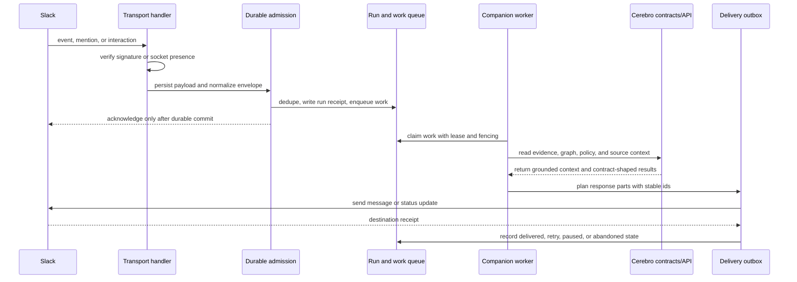

# Cerebro Slack companion

This workspace owns the portable behavior of the Cerebro Slack companion. It is an adapter over the public `AgentServiceLifecycle` contract, not a deployment definition.

The first supported path is durable admission:

1. Verify the installation, service presence, and required capabilities.
2. Atomically deduplicate the Slack input, commit its run receipt, append the admission transitions, and place the run on a durable queue.
3. Permit the Slack acknowledgement only after that transaction succeeds.
4. Return the existing receipt when Slack retries the same input.

## Slack To Cerebro And Back

The companion treats Slack as transport and attention, not as the system of record. It persists and acknowledges Slack input first, performs work through portable Cerebro contracts, then delivers the result back through a durable outbox.

The same shape applies to longer-running work. Slack-visible status can show queued, degraded, recovery, or completed states while leases, checkpoints, and receipts keep retries idempotent.

## Assistant turns

`assistantTurnBudget` maps the model-selected execution lane to bounded tool calls, selected capabilities, and latency. Hosts may lower those limits, but they cannot expand them past the portable contract. `normalizeAssistantTurnProgress` exposes the same planning, checking, synthesis, delivery, completion, and blocked phases across Slack hosts.

Hosts should record the message parts Slack accepted, not an internal draft. Evaluation and conversation continuity then describe what the person actually received, including partial and failed deliveries.

Durable schedule definitions keep a stable schedule identity, revision, work
digest, cadence anchor, and misfire policy. The portable planner derives the
same due times after a restart or topology change and materializes occurrences
with the existing `(schedule_id, due_at, schedule_revision)` identity. Runtime
stores, destination bindings, and scheduler deployment policy remain host-owned.

## Canonical work cases

`src/canonical-work` projects a Cerebro compliance work item into a resumable
Slack-facing case. Cerebro remains authoritative for queue state, ownership,
versions, occurrences, remediation, and assurance verification. The companion
stores the case projection, exact command intent, and digest-bound approval
receipt.

Every write is fenced by the current work-item version. A retry after an
unknown command result first reads canonical state and does not repeat an
effect that Cerebro already applied. Remediation and fresh assurance remain
separate commands; the case closes only after the canonical response reaches a
terminal state.

Hosts implement `CanonicalWorkItemPort` with the public Cerebro SDK and provide
a durable `DurableCanonicalWorkCasePort`. Credentials, endpoints, deployment
configuration, and provider-specific stores are outside this workspace.

## Alert triage

`src/triage` owns portable alert-triage, evidence, and suggestion lifecycles.
Machine-specific transitions keep triage, evidence freshness, and suggestion
delivery states distinct. An actionable decision can plan a suggestion only
when every referenced receipt is current, accessible, and within its validity
window. Planning uses stable caller-provided action identity so a retry produces
the same suggestion identity.

The host owns source queries, channel admission, prompts, persistence, and
delivery adapters. Those adapters persist the versioned records and transition
events without changing the portable decision policy.

Production implementations of `DurableAdmissionPort` must use durable storage with one transaction or an equivalent recoverable commit protocol. The in-memory implementation under `src/testing` is a conformance fixture only.

This workspace must not contain credentials, infrastructure identifiers, environment routes, deployment manifests, or provider-specific persistence adapters. Those belong in the private operational repository. A deployment may replace every port without changing the Slack application identity, binding identity, run identity, or thread identity.
