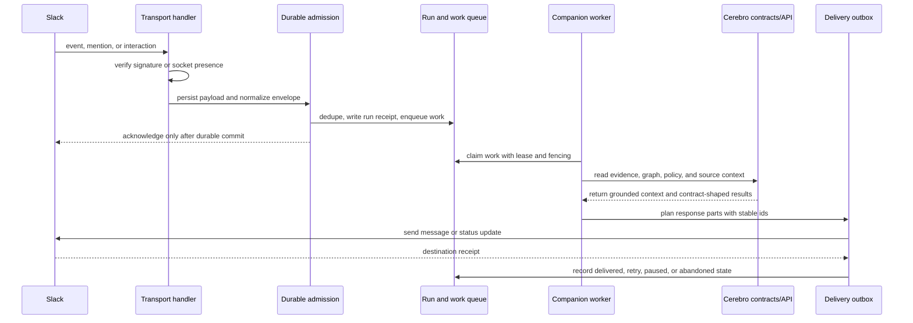

# Cerebro Slack companion

This workspace owns the portable behavior of the Cerebro Slack companion. It is an adapter over the public `AgentServiceLifecycle` contract, not a deployment definition.

The first supported path is durable admission:

1. Verify the installation, service presence, and required capabilities.
2. Atomically deduplicate the Slack input, commit its run receipt, append the admission transitions, and place the run on a durable queue.
3. Permit the Slack acknowledgement only after that transaction succeeds.
4. Return the existing receipt when Slack retries the same input.

## Slack To Cerebro And Back

The companion treats Slack as transport and attention, not as the system of record. It persists and acknowledges Slack input first, performs work through portable Cerebro contracts, then delivers the result back through a durable outbox.

The same shape applies to longer-running work. Slack-visible status can show queued, degraded, recovery, or completed states while leases, checkpoints, and receipts keep retries idempotent.

## Assistant turns

`assistantTurnBudget` maps the model-selected execution lane to bounded tool calls, selected capabilities, and latency. Hosts may lower those limits, but they cannot expand them past the portable contract. `normalizeAssistantTurnProgress` exposes the same planning, checking, synthesis, delivery, completion, and blocked phases across Slack hosts.

Hosts should record the message parts Slack accepted, not an internal draft. Evaluation and conversation continuity then describe what the person actually received, including partial and failed deliveries.

### Image questions

`planSlackQuestionImageInput` accepts host-projected Slack file references and produces a durable, byte-free image manifest. Image-only mentions receive a concrete inspection question. Captioned images preserve the person's question. The plan requires both `slack.files.read` and `agent.input.image` capabilities.

`resolveQuestionImageInput` asks a host-owned resolver for authenticated private file bytes and returns model-ready image content. The host owns Slack authorization, trusted download hosts, redirect policy, and network access. Portable policy accepts PNG, JPEG, WebP, and GIF, with at most four images, 4 MB per image, and 8 MB total. Resolved bytes must match the declared media type and are never part of durable question work.

`evaluateAssistantTurn` scores one text-free observation derived from durable delivery, claim, source, feedback, and outcome records. An unwanted response, missed response, incomplete delivery, omitted required action, ungrounded or subject-misbound claim, unused available source, missing coverage boundary, hidden source failure, exposed internal machinery, redundant tool call, unnecessary clarification, user correction, or negative feedback is explicit in the receipt. `decideAssistantTurnPromotion` compares one candidate with its exact baseline on at least eight sealed static cases and eight independently generated shadow cases. Duplicate case content cannot count in both partitions. Promotion requires a strict score gain, no blocker increase, fewer blockers when the baseline has any, no material case regression, and no new per-case blocker.

`ImprovementCoordinator.recordOutcomeEvidence` is the only path that can make evaluation, shadow, and promotion evidence fresh. It binds the baseline rows to the pre-authoring head, binds candidate rows to the authored head, runs the promotion decision, and records those three evidence classes only when the decision passes. Generic CI and canary receipts cannot bypass the outcome gate. A candidate becomes ready only when all five exact-head evidence classes are fresh.

## Command and delivery projections

`encodeSlackCommandEnvelope` and `encodeSlackActionEnvelope` produce bounded, versioned values for transport-owned command and interaction handlers. Their decoders reject unknown fields and malformed input before admission. `projectSlackVisibleStatus`, `projectAssistantTurnProgress`, and `projectSlackMultipartDelivery` produce stable host-neutral operations and exact accepted-part records. Private adapters choose routes and Slack API methods.

Durable schedule definitions keep a stable schedule identity, revision, work
digest, cadence anchor, and misfire policy. The portable planner derives the
same due times after a restart or topology change and materializes occurrences
with the existing `(schedule_id, due_at, schedule_revision)` identity. Runtime
stores, destination bindings, and scheduler deployment policy remain host-owned.

## Canonical work cases

`src/canonical-work` projects a Cerebro compliance work item into a resumable
Slack-facing case. Cerebro remains authoritative for queue state, ownership,
versions, occurrences, remediation, and assurance verification. The companion
stores the case projection, exact command intent, and digest-bound approval
receipt.

Every write is fenced by the current work-item version. A retry after an
unknown command result first reads canonical state and does not repeat an
effect that Cerebro already applied. Remediation and fresh assurance remain
separate commands; the case closes only after the canonical response reaches a
terminal state.

Hosts implement `CanonicalWorkItemPort` with the public Cerebro SDK and provide
a durable `DurableCanonicalWorkCasePort`. Credentials, endpoints, deployment
configuration, and provider-specific stores are outside this workspace.

## Alert triage

`src/triage` owns portable alert-triage, evidence, and suggestion lifecycles.
Machine-specific transitions keep triage, evidence freshness, and suggestion
delivery states distinct. An actionable decision can plan a suggestion only
when every referenced receipt is current, accessible, and within its validity
window. Planning uses stable caller-provided action identity so a retry produces
the same suggestion identity.

The portable channel policy classifies host-supplied message text and applies
host-supplied channel membership and confidence thresholds. The host owns
channel membership lookup, source queries, prompts, persistence, and delivery
adapters. Those adapters persist the versioned records and transition events
without changing the portable decision policy.

The deterministic fallback accepts host-supplied alert text and research
records. It never authorizes a reply: explicit test markers are non-actionable,
and every other degraded result needs more context. Model and research calls,
credentials, transport, persistence, and deployment remain host-owned.

## Proactive follow-ups

`src/followup` decides whether, and what, to proactively offer after a delivered
assistant turn so the companion stays engaged without nagging. `planProactiveFollowup`
only offers on an answered or partial turn, drops candidates whose kind is not
allowed or that carry no grounding reference, and dedupes any action already
offered or accepted in the thread. A cooldown and a per-window engagement budget
bound how often the companion re-engages. The result is bounded, deterministically
ordered by priority, and carries stable idempotent identities so a retry never
double-offers. The host owns candidate derivation, durable engagement history,
and Slack transport.

## Re-engagement on stale work

`src/reengagement` decides whether, and on which quiet work items, to re-engage
so the companion does not drop the ball on open watches or canonical-work cases.
`planReengagement` treats an item as eligible only when it is still open, has
been idle at least the policy's staleness window, and has not been nudged within
its per-item cooldown. Eligible items are ordered by priority then staleness,
capped by a per-run limit and a per-window engagement budget, and carry stable
idempotent identities keyed to the observed state so a retry never double-nudges
while a genuinely advanced item earns a fresh nudge. The host owns which items
are open, their last-activity timestamps, durable nudge history, and Slack
transport.

## Clarifying questions

`src/clarification` decides whether to ask exactly one high-value clarifying
question or to proceed with a best-effort answer, so the companion is useful
without over-asking. `planClarification` treats a candidate as askable only when
the missing information is answer-blocking, when no safe default covers it below
the policy's impact threshold, and when the same question was not already asked
in the thread. When several remain it asks the single most consequential one and
defers the rest with a reason; when nothing is askable or the per-thread question
budget is spent, it proceeds instead of nagging. The host owns candidate
derivation, durable clarification history, and Slack transport.

## Progress narration

`src/progress` decides whether an in-flight progress event is worth narrating to
Slack, so long-running turns feel alive without noisy edits. `planProgressNarration`
always publishes a terminal phase (past the throttle and budget) so the final
state is never dropped; otherwise it publishes only when the phase advances, the
status text changes, or the heartbeat interval has elapsed, subject to a minimum
interval between updates and a per-turn update budget. Out-of-order or
already-narrated sequences are suppressed, the first update posts and later ones
edit, and identities are stable per `(turn_ref, sequence)` so a retry never
double-posts. The host owns progress emission, the durable narration state, and
Slack transport.

## History learning admission

`slackLearningCandidateRejection` classifies a host-supplied message projection
before it can become a learning candidate. Machine-authored messages, Slack
subtypes, incomplete records, empty text, and direct mentions of the companion
are rejected with stable reason codes. Slack history fetching, authorization,
storage, and learning execution remain host-owned.

## Security text redaction

`redactSecurityText` replaces common credential-shaped values in one bounded
text field before a host persists or displays it. Oversized and non-string
runtime values fail closed; the helper never returns a partially checked value.
Hosts still own structured-field allowlists, log and telemetry policy, storage,
and incident handling. The redactor is a final text boundary, not a credential
scanner or authorization decision.

## Source health

`src/execution/source-health-policy.ts` applies failure cooldown, successful recovery, slow-source degradation, and stable ranking to caller-owned state. It reuses the portable consecutive-failure and capacity-cooldown records so the host can commit one coherent aggregate.

The host owns source calls, persistence, probe scheduling, and policy values. This module does not poll sources, create a store, or choose deployment behavior.

## Durable answer watches

`src/watch` binds a watch to one read-only, server-resolved target recorded with
the delivered answer. Interactive requests carry the binding reference, while
the host resolves the target and records the evidence, version, and digest.
Only the original requester or a recorded operator can start the watch.

Each check uses the canonical scheduled-occurrence lease and fencing contract.
Portable policy compares structured state, publishes material changes,
suppresses unchanged checks, shows degraded and recovered states, and
distinguishes a satisfied condition from a target that closed first. The host
owns source polling, durable storage, authorization lookup, and Slack transport.

Observation and stop retries require a durable receipt lookup before portable
policy runs. A first execution returns an immutable receipt that the host must
commit with the watch update. Later retries return that receipt even after
other observations or retirement, while the current watch revision remains
unchanged. A missing or conflicting receipt lookup fails closed.

## Evidence rechecks

`src/recheck` admits a recheck only for evidence already bound server-side to a
fully delivered answer and its durable conversation thread. The requester does
not select an evidence location or submit the binding contents. A required
host-owned lookup resolves the immutable binding before authorization policy
runs. Only the original requester or a recorded operator can use the binding.
The binding includes a canonical digest of the
completed delivery receipt and its ordered part receipts; duplicate part or
idempotency identities fail closed.

Admission derives stable recheck, run, queue-item, and receipt identities. The
host must commit the immutable request, canonical reconciliation run, admission
transitions, queue item, and receipt in one durable transaction before transport
acknowledgement is permitted. Exact retries return the existing receipt;
conflicting receipt reuse fails closed. Portable status projections show queued,
duplicate, in-progress, completed, degraded, and rejected states.

The public module contains only records, validation, deterministic policy, and
synthetic tests. Evidence resolution, persistence, execution, authorization
lookup, and Slack transport remain host-owned.

## Dangerous-intent safety policy

`src/safety` owns deterministic normalization, dangerous-intent classification,
category precedence, safety decisions, and refusal text. Hosts decide where to
apply the policy and own authorization, tool selection, configuration, logging,
telemetry, persistence, and Slack transport.

Production implementations of `DurableAdmissionPort` must use durable storage with one transaction or an equivalent recoverable commit protocol. The in-memory implementation under `src/testing` is a conformance fixture only.

This workspace must not contain credentials, infrastructure identifiers, environment routes, deployment manifests, or provider-specific persistence adapters. Those belong in the private operational repository. A deployment may replace every port without changing the Slack application identity, binding identity, run identity, or thread identity.
