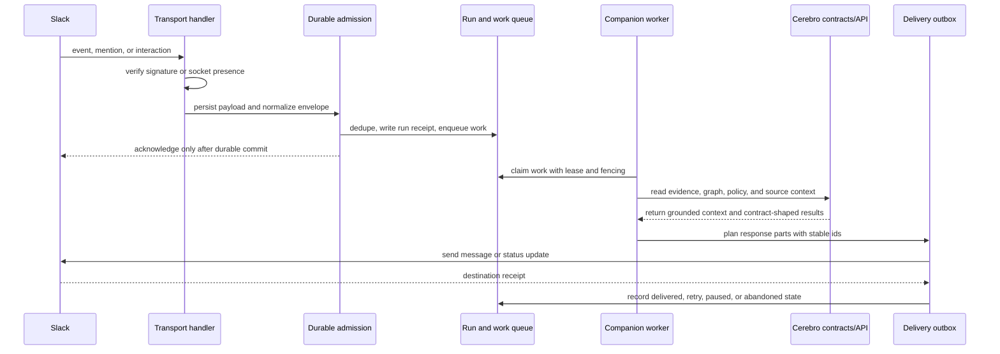

# Cerebro Slack companion

This workspace owns the portable behavior of the Cerebro Slack companion. It is an adapter over the public `AgentServiceLifecycle` contract, not a deployment definition.

The first supported path is durable admission:

1. Verify the installation, service presence, and required capabilities.
2. Atomically deduplicate the Slack input, commit its run receipt, append the admission transitions, and place the run on a durable queue.
3. Permit the Slack acknowledgement only after that transaction succeeds.
4. Return the existing receipt when Slack retries the same input.

## Slack To Cerebro And Back

The companion treats Slack as transport and attention, not as the system of record. It persists and acknowledges Slack input first, performs work through portable Cerebro contracts, then delivers the result back through a durable outbox.

The same shape applies to longer-running work. Slack-visible status can show queued, degraded, recovery, or completed states while leases, checkpoints, and receipts keep retries idempotent.

## Assistant turns

`assistantTurnBudget` maps the model-selected execution lane to bounded tool calls, selected capabilities, and latency. Hosts may lower those limits, but they cannot expand them past the portable contract. `normalizeAssistantTurnProgress` exposes the same planning, checking, synthesis, delivery, completion, and blocked phases across Slack hosts.

Hosts should record the message parts Slack accepted, not an internal draft. Evaluation and conversation continuity then describe what the person actually received, including partial and failed deliveries.

Production implementations of `DurableAdmissionPort` must use durable storage with one transaction or an equivalent recoverable commit protocol. The in-memory implementation under `src/testing` is a conformance fixture only.

This workspace must not contain credentials, infrastructure identifiers, environment routes, deployment manifests, or provider-specific persistence adapters. Those belong in the private operational repository. A deployment may replace every port without changing the Slack application identity, binding identity, run identity, or thread identity.
