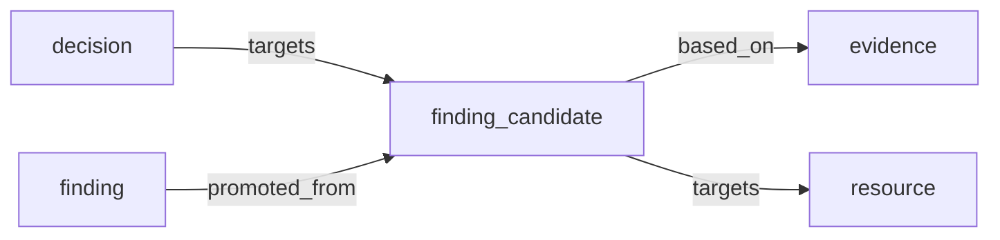

# Finding Candidate Operations

Candidate findings let operators evaluate rules against real runtime data without
writing production findings or evidence. Promotion is the explicit handoff from a
reviewed candidate snapshot into production finding state.

## Smoke Validation

Run the deployed candidate API smoke against a runtime with known replay data:

```bash
make candidate-smoke \
  CEREBRO_BASE_URL=https://cerebro.example.com \
  CEREBRO_API_KEY="$CEREBRO_API_KEY" \
  RUNTIME_ID=<runtime-id> \
  RULE_ID=rule-id \
  CANDIDATE_SMOKE_EVENT_LIMIT=25
```

The smoke validates:

- `/health` responds.
- Candidate evaluation completes for the runtime.
- Candidate list/get APIs can read persisted candidates.
- Production findings for the same runtime/rule are unchanged by candidate-only evaluation.

If a quiet runtime is intentionally expected to produce no candidate rows, set
`CEREBRO_CANDIDATE_SMOKE_ALLOW_EMPTY=true`. Do not use that for release smoke
coverage unless the runtime/rule pair is known to be quiet.

## Telemetry

Candidate workflows emit structured telemetry events:

- `finding_candidate.run`: one event per completed or failed candidate run, with
  `runtime_id`, `rule_id`, `status`, `events_evaluated`, `events_matched`,
  `candidates_emitted`, and `duration_ms`.
- `finding_candidate.list`: list-time health signal with `candidate_count`,
  `open_candidate_count`, `promoted_count`, `rejected_count`, and
  `stale_candidate_count`.
- `finding_candidate.promotion`: one event per promotion or idempotent
  re-promotion, with `candidate_id`, `finding_id`, `decision_id`, `outcome`,
  `observation_count`, and `duration_ms`.
- `finding_candidate.rejection`: one event per rejection or idempotent
  re-rejection, with `candidate_id`, `decision_id`, `outcome`,
  `observation_count`, and `duration_ms`.

These events are intentionally low-cardinality except for object IDs needed to
debug one workflow. Dashboards should aggregate by `runtime_id`, `rule_id`,
`status`, and `outcome`.

## Candidate Lifecycle Authorization

Promotion mutates production finding state, and rejection closes a reviewed
candidate. When API auth is enabled, both lifecycle writes require the dedicated
scope:

```text
cerebro.finding_candidates.promote
```

Tenant authorization still applies before the scope check. Read-only security
clients with `cerebro.cosmo.security.read` can list/get candidates but cannot
promote or reject them.

## Next Lifecycle Slice

The current durable statuses are `candidate`, `promoted`, and `rejected`. The next
lifecycle slice should add:

- `expired`: candidate aged out without review after a configured TTL.
- `superseded`: a newer candidate fingerprint or rule version replaced this snapshot.

Recommended follow-up API additions:

- `POST /finding-candidates/{candidateID}/expire`
- `GET /source-runtimes/{runtimeID}/finding-candidates?status=rejected`

Graph projection should materialize candidate nodes before promotion:



This gives reviewers and agents a queryable trail for what was tested, rejected,
expired, superseded, or promoted.
