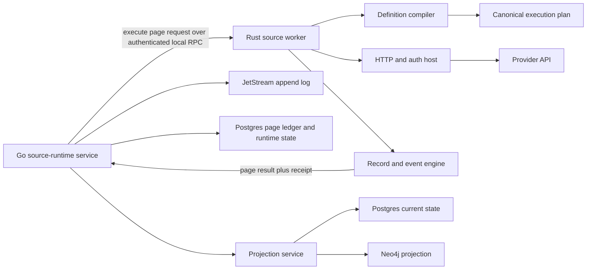

# ADR: Native Rust Source Runtime

- **Status:** Proposed
- **Date:** 2026-07-15
- **Base decision:** [`rust-control-kernel-carve.md`](rust-control-kernel-carve.md)
- **Related boundaries:** [`non-goals.md`](non-goals.md), [`source-cdk-extraction.md`](source-cdk-extraction.md), [`durability-contract.md`](durability-contract.md), [`development.md`](development.md)

## Decision

Cerebro will add a native Rust source-runtime process that executes normalized connector definitions and returns validated source pages to the existing Go compatibility plane. The unit of connector authoring becomes a versioned, language-neutral definition and proof bundle, not a generated Go package.

This is the target boundary, not permission to translate working Go packages. The
native worker advances only when an implementation slice deletes an existing
ownership surface or proves a safety property that the current Go path leaves to
runtime checks and review.

The first Rust runtime owns shared provider execution:

- definition validation and compilation into a canonical execution plan;
- endpoint construction and egress policy enforcement;
- authentication, token caching, request signing, retries, and rate-limit handling;
- pagination, fan-out, incremental cursors, checkpoints, and freshness probes;
- provider-record decoding, field selection, redaction, stable identity, and event construction;
- event-contract validation and bounded execution receipts.

The Go compatibility plane remains authoritative for:

- source-runtime configuration and secret resolution;
- runtime leases and page-attempt ownership;
- append-log publication and dead-letter recovery;
- checkpoint and current-state commits in Postgres;
- graph and current-state projection writes;
- existing HTTP, Connect, CLI, SDK, and MCP compatibility surfaces.

This is a runtime-boundary migration. It is not a connector-by-connector translation project, a second persistence path, or a third-party plugin marketplace.

## Customer outcome

An operator should be able to add or deepen a source without waiting for a new hand-written runtime loop. A source is ready when Cerebro can prove, from fixtures and bounded provider probes, that it:

1. authenticates with the declared mechanism;
2. reaches every declared resource family;
3. resumes without skipping or duplicating provider state;
4. emits stable tenant-scoped identities and contract-valid events;
5. projects the intended entities and relationships;
6. reports missing scope, permission, rate-limit, and provider failures as distinct states;
7. can be replayed and compared before it becomes authoritative;
8. does not duplicate or skip current evidence when a worker crashes during publication;
9. rejects late writes after lease loss, engine rollback, or authority transfer;
10. keeps raw credentials out of the source-runtime protocol and limits each credential lease to one operation;
11. records every promotion and rollback with its evidence, thresholds, reason, and actor.

The visible product state is not “connector installed.” It is a source runtime
with explicit family coverage, last successful observation, current checkpoint,
rejected-record count, projection result, proof revision, runtime revision, current engine,
authority revision, pending promotion or rollback, and page recovery state. A
quarantined page shows its bounded reason and the available retry, supersede,
replay, or resync action. An `authority_transition_blocked` family shows the
pending decision, stream capacity or reserve failure, current engine, stopped
execution state, and `restore capacity` action. Capacity recovery automatically
reconciles the decision before the family resumes. A
`source_replacement_pending` runtime shows the old and requested source,
replacement operation ID, old-generation family closure progress, and retry
state. It exposes `Retry source replacement` with the blocked family and page,
authority, capacity, or stream-health reason.

## Why this decision exists

The repository currently contains these source-model boundaries:

- `internal/connectordefinitions.Definition` is a versioned connector manifest.
- `sources/internal/catalogruntime` turns a normalized definition into an executable JSON API source.
- `sources/internal/jsonapi` centralizes common auth, HTTP, pagination, fan-out, record selection, and event mapping.
- `internal/sourcecdk.Source` defines `Check`, `Discover`, and paged `Read` operations.
- `internal/sourceruntime.Service.Sync` owns the append, projection, checkpoint, quarantine, and page-commit sequence.
- `internal/sourceprojection` turns events into state and graph records outside source packages.
- `internal/sourcegen` and the connector catalog already produce proof and promotion artifacts.

The problem is not the absence of a connector factory. The problem is that the factory still materializes too much Go source and too much compile-time wiring.

The current repository snapshot, measured with `tools/codegenstatus` and
`tools/sourcefidelity`, contains:

- 798 connector definitions;
- 797 definitions accepted by the normalized generator grammar;
- one definition classified as requiring a bespoke runtime;
- 16 shared projection templates;
- 820 entries in the source-fidelity inventory and 799 runtime sources;
- 43 sources at the current high-fidelity threshold;
- 743 sources that still need realistic fixtures;
- 736 sources that still need every-family tests;
- 752 sources that still need deploy-family coverage;
- a 5,827-line compile-time source registry;
- a 6,407-line compile-time projector registry;
- generated adapters that repeat large maps of paths, selectors, identity keys, and static attributes already present in connector definitions.

Moving each package to Rust would preserve that shape and create a large Rust workspace with the same registration, fidelity, and review problems. The useful Rust boundary is the shared execution engine under the declarative catalog.

## Proven boundary in the current tree

The repository now contains a smaller executable proof in
`internal/sourceruntime/recordkernel`. It deliberately leaves credentials,
provider requests, retries, leases, append, projection, and checkpoint commits
in Go. A bounded Rust/Wasm guest receives one credential-free page and mapping
contract, then returns accepted records, quarantine references, a proposed
cursor, and deterministic receipts.

That proof establishes the first reusable primitives:

- an unvalidated plan cannot execute because the executable method exists only
  on the validated Rust type;
- an execution permit is move-only and cannot authorize a second call;
- host encoding, guest input, guest output, memory, and execution time are
  bounded before any result is accepted;
- the guest has zero function imports and zero memory imports;
- empty cursor-only pages map successfully;
- malformed signed limits return bounded contract rejections instead of being
  reported as worker failures;
- native and embedded tests prove stable output across JSON object key order;
- the canonical artifact and its ABI, hash, and size are checked in the shared
  embedded-Wasm manifest;
- the Rust workspace enforces formatting, Clippy warnings, tests, dependency
  policy, a 90% line-coverage floor, and bounded embedded-host benchmark smoke;
- embedded-host failures preserve wrapped causes while exposing typed invalid
  input, ABI or memory, guest status, invalid output, timeout, and cancellation
  diagnostics.

It does not establish that provider HTTP, authentication, retry, or pagination
should move to Rust. Those capabilities already work in Go. This ADR requires
the later native worker to earn that larger boundary through registry deletion,
definition-driven coverage, failure isolation, and live differential evidence.
If it cannot, Cerebro keeps provider transport in Go and expands only the
credential-free record kernel.

## Current native event-admission slice

Source sync now uses a smaller native Rust process before the broader provider
runtime described by this ADR exists. After Go materializes a source page, the
native event-admission worker validates contracts, quarantines bounded missing
fields, rejects conflicting event identities, deduplicates the page, and
returns deterministic receipts before append.

This worker has no provider, network, credential, append-log, database, or
projection capability. Go starts a bounded pool of release-pinned child
processes and communicates over parent-owned stdin and stdout pipes with
length-delimited CBOR frames. A canceled or malformed exchange terminates that
worker; the next page starts a clean process. Admission fails closed when the
worker cannot return a valid result. It does not fall back to Go or Wasm after
an execution failure.

The embedded Wasm build remains the differential oracle. The benchmark corpus
runs the same Rust implementation through JSON/Wasm, JSON/native, and
CBOR/native transports and compares the complete outcomes. This preserves the
existing JSON contract for the embedded artifact while removing JSON and fresh
Wasm instantiation from the production source-sync path.

The pipe protocol is deliberately narrower than the authenticated local RPC
planned for provider execution. The child inherits no listening socket and can
only exchange framed admission requests with its parent. Moving provider HTTP,
credentials, or runtime capabilities into Rust still requires the later
versioned protobuf and authenticated Unix-socket boundary below.

## Why Rust, and where Rust is not the reason

The decision is narrower than “Rust is safer”:

| Boundary rule | Rust property | Go position | Decision consequence |
| --- | --- | --- | --- |
| A draft plan cannot execute | typestate exposes execution only on `SourcePlan<Validated>` | standard Go methods cannot depend on a compile-time state parameter | keep plan compilation and validation in Rust |
| One grant authorizes one execution | ownership makes the permit move-only | standard Go has no user-defined move-only value | consume execution authority inside Rust |
| Internal state additions reach every handler | closed enums and exhaustive Rust matches | Go wire consumers still validate string states at runtime | use Rust enums internally; validate every cross-language state at the ABI |
| Mapping code has no ambient capabilities | the committed Wasm guest has no imports | the pinned standard Go Wasm runtime imports WASI process services | keep agent-written mapping inside the no-import guest |
| Provider HTTP, auth, retries, and pagination work | no language-exclusive property | the existing Go hosts already implement these operations | move them only when one native worker deletes duplicated runtime ownership |
| A crash is isolated from the API process | separate process boundary | a separate Go process can provide the same isolation | process isolation alone does not justify a rewrite |

The Rust-specific case is compile-time authority and state discipline around
untrusted, frequently changed mapping and plan logic. The native-process case is
operational consolidation. They are related but they are not the same claim.

## Current execution path

Today a source-runtime sync follows this sequence:

```text
stored SourceRuntime
  -> acquire source implementation from registry
  -> resolve secret-backed config
  -> Read or ReadWithCheckpoint
  -> materialize tenant/runtime fields
  -> admit the page through the native Rust worker
  -> validate the returned decisions and deterministic receipt
  -> begin page-attempt ledger entry
  -> append the accepted event page to JetStream
  -> project each event into current state and graph
  -> commit checkpoint, next cursor, and runtime status
```

This ordering prevents a checkpoint from advancing before accepted events are
published and projected. The Rust runtime replaces only the provider-execution
segment. It does not move append, projection writes, or checkpoint commit across
the process boundary in the first release.
The current Go path resolves credentials in-process. The Rust worker may handle
provider traffic only after raw credentials are absent from the source-runtime
protobuf path and one-operation credential-lease redemption is available.

## Architectural shape



The process runs as a native Linux service. There is no CGO, `dlopen`, or
in-process Go/Rust FFI. The first release runs the worker on the same host as
the compatibility plane and uses an authenticated Unix-domain socket. A
distributed worker requires a later decision covering workload identity, the
credential-broker location, the authenticated secret-byte channel, and failure
semantics before Connect or gRPC transport is enabled. Both modes use the same
versioned protobuf contract and require a short-lived runtime capability.

The current capability-free admission child described above is not that
provider worker: it uses parent-owned pipes because it has no independent
caller, credential channel, network capability, or long-lived runtime
identity.

## Ownership boundaries

### Rust source worker

The worker owns deterministic and provider-facing work that can be retried without committing platform state:

- parse a canonical execution plan;
- validate the plan before any network request;
- validate resolved configuration against the plan's config schema;
- derive the exact provider request for one operation and page;
- enforce scheme, host, port, redirect, DNS, and response-size policy;
- obtain or refresh provider credentials without persisting them;
- execute bounded requests under the request deadline;
- classify provider failures using a stable error taxonomy;
- decode one response page;
- compute the next provider cursor and proposed checkpoint;
- map records into canonical event envelopes;
- validate required attributes, required payload fields, identity fields, and schema references;
- deduplicate events within the page;
- return a page receipt with content digests and execution measurements.

The worker does not know how to write JetStream, Postgres, or Neo4j. It does not advance a durable checkpoint. It does not decide whether a page owns a lease. It cannot declare projection success.

### Go compatibility plane

The compatibility plane owns stateful coordination:

- load a stored runtime under its tenant;
- load its durable runtime generation;
- acquire and renew its lease with a monotonic fencing token;
- load the source-family authority epoch;
- resolve credential references through the existing resolver into a one-call credential lease;
- issue one bounded capability for one runtime operation, lease fence, authority epoch, and canonical request intent;
- call the worker with the current durable checkpoint and page cursor;
- independently validate the returned envelope and receipt;
- create or resume the durable logical page attempt and ordered event outbox;
- publish accepted events;
- project the events;
- atomically accept a worker result only when the runtime lease fence, authority epoch, and request-intent digest still match;
- atomically commit accepted runtime progress only when the publish-claim fence, authority epoch, request-intent digest, and input progress still match;
- preserve existing API behavior and redaction.

The Go caller may retry an identical page request. The worker must return the same logical page for the same execution-plan digest, input cursor, checkpoint, scope, and provider response.

### Projection boundary

Sources still do not write graph records. Initially the Rust worker emits the existing `cerebro.v1.EventEnvelope`. Existing Go projectors remain authoritative.

A later phase may move deterministic event-to-projection calculation into Rust. If it does, Rust returns a `ProjectionDelta` containing normalized entities, links, and retractions. Go remains the only writer to Postgres and Neo4j. The delta is validated and can be recomputed from the appended event.

## Canonical connector definition

YAML remains an authoring format, not a runtime ABI. A build-time compiler normalizes `connectordefinitions.Definition` into `SourceExecutionPlanV1`, serialized with deterministic protobuf encoding and identified by a SHA-256 digest.

The execution plan contains:

| Section | Required content |
| --- | --- |
| Identity | schema version, source ID, definition revision, plan digest |
| Configuration | public fields, secret-reference fields, required fields, validation rules |
| Egress | allowed schemes, provider hosts, base-path constraints, redirect policy, private-endpoint policy |
| Authentication | auth model, header/signature rules, token endpoint, scopes, cache partition keys |
| Families | family ID, method, path template, request bindings, response selector |
| Pagination | cursor kind, input binding, output selector, termination rule, page-size limit |
| Incremental state | opaque cursor or high-watermark semantics, overlap policy, reconciliation interval |
| Identity | provider ID selectors, canonical encoding rule, URN kind, fallback prohibition |
| Events | kind, schema reference, payload selection, required fields, stable attributes |
| Projection intent | template, entity identity fields, relationships, retraction keys |
| Coverage | dimensions, support level, evidence types, control domains |
| Limits | request count, response bytes, records per page, wall time, fan-out cardinality |
| Proof | fixture digests, provider-contract lock digest, generator revision, review state |

Runtime execution never consults unnormalized YAML maps. Unknown plan fields are rejected unless the schema revision explicitly declares forward-compatible handling.

## Source execution protocol

The new internal protocol will be defined in
`proto/cerebro/v1/source_runtime.proto` and generated for both Go and Rust. It
is not exposed as a new public route in the first phase.

### Operations

The worker supports four operations:

- `DescribePlan`: return plan identity, supported families, and capability requirements.
- `Check`: validate configuration and execute the declared verification request.
- `Discover`: return bounded URNs for one family or declared scope.
- `ReadPage`: return one page of events, a proposed checkpoint, and a receipt.

There is no `Sync` operation in the worker. Sync owns durable state and remains in the compatibility plane.

### ReadPage request

`ReadPageRequest` carries:

- protocol and execution-plan versions;
- plan bytes or a previously registered plan digest;
- tenant, runtime, durable runtime generation, source, and family IDs;
- stable logical page ID, page-attempt ID, and idempotency key;
- current durable checkpoint and provider continuation cursor as separate values;
- resolved public config values;
- an opaque, short-lived credential-lease reference; raw secret values are not protobuf fields;
- source scope and path-parameter values;
- request deadline and hard resource limits;
- current runtime-lease fence and source-family authority epoch;
- canonical request-intent digest covering the plan, public configuration, scope, progress, limits, and operation;
- capability token binding the caller to the exact runtime, source, family, operation, lease fence, authority epoch, and request-intent digest;
- optional trace context.

The capability token cannot authorize another source, family, tenant, runtime,
runtime generation, operation, plan revision, lease generation, authority
generation, or request intent. The worker rejects an expired or mismatched
token before resolving a provider URL or asking the credential broker for
secret bytes.

### ReadPage result

`ReadPageResult` carries:

- the same tenant, runtime, runtime generation, source, family, attempt, and idempotency identities;
- the same runtime-lease fence, authority epoch, and request-intent digest;
- execution-plan digest and worker build identity;
- ordered event envelopes;
- next provider cursor, when more provider pages exist;
- proposed checkpoint and watermark;
- short-circuit and reconciliation reasons;
- scanned, accepted, and rejected record counts;
- bounded rejection summaries without raw sensitive payloads;
- provider revision, ETag, or response digest when available;
- request count, response bytes, retry count, and rate-limit observations;
- a canonical digest over the logical result;
- a worker receipt signed or authenticated by the process identity.

The result never includes an access token, client secret, cookie, authorization header, or unredacted rejected record.

## Lease, authority, and commit fencing

Cancellation is not a commit guarantee. A worker may finish after its caller
loses a lease, after an operator rolls a family back to Go, or after a newer
attempt has acquired authority. Every state transition therefore carries and
checks three independent values:

- the runtime lease fence, a monotonically increasing token returned by lease acquisition;
- the source-family authority epoch, incremented whenever execution authority changes or is revoked;
- the canonical request-intent digest for the exact operation being committed.

The worker echoes all three values in its result and authenticated receipt. Go
acquires the per-runtime, per-family publication barrier and checks them against
current durable state before accepting the result into a logical page attempt.
The acceptance transaction also requires that no authority change is pending.
It holds the barrier until `prepared` and its publish claim are durable. A
mismatch or pending authority change rejects the result before its first append.
A late result cannot regain authority through retry, and cancellation alone is
never treated as the fence.

Rollback increments the authority epoch before another engine receives a new
capability. Lease reacquisition increments the runtime fence. Capability
issuance and credential-lease redemption require the current runtime fence. An
accepted page then uses the transferable publish claim defined below. Event
publication, projection, and the final progress commit require the current
publish-claim fence, unchanged authority epoch and request-intent digest, and
the same unsuperseded logical page identity.

## Cursor and checkpoint rules

The current code correctly treats page continuation and durable progress as different concepts. The Rust boundary preserves that distinction.

- A cursor resumes the next provider page in the current run.
- A checkpoint is a proposed durable watermark after accepted events are committed.
- The Go caller sends the same original durable checkpoint across pages in one bounded sync when the source needs it for incremental filtering.
- The worker may propose a checkpoint but cannot commit it.
- Empty pages may carry a next cursor.
- A not-modified response may refresh checkpoint metadata without emitting events.
- A high-watermark source must declare overlap and equality behavior.
- The existing Go-compatible continuation cursor remains opaque and is
  persisted unchanged in `NextCursor` during migration. Depending on the
  source, that value may be a provider-native token or an existing Cerebro
  composite that includes fan-out position and nested provider state. The
  execution plan declares its format but does not wrap it in a Rust-only value.
- Source, family, plan digest, engine, and cursor-schema identity are stored as
  separate progress metadata. Go validates that metadata before it sends the
  exact Go-compatible continuation cursor to either engine.
- Worker-only continuation state, when required, uses a separate versioned
  field. It cannot replace `NextCursor` and is never passed to a Go source as a
  continuation token.
- A new cursor representation requires an explicit converter back to the exact
  Go-compatible continuation value plus differential resume and rollback
  fixtures before that family can become authoritative.
- Reconfiguration that changes progress-affecting fields invalidates incompatible continuation state through the existing configuration digest rule.

## Identity and event rules

Provider display names are not identities. Each family declares stable provider ID selectors and one canonical encoding rule.

The worker rejects a record when:

- no declared stable ID is present;
- two declared identities disagree under a family rule that requires equality;
- the canonical ID or resulting URN exceeds its bound;
- provider-controlled delimiters would produce an ambiguous identity;
- required tenant, source, family, event, or schema fields are missing;
- the event kind does not belong to the plan;
- required attributes or payload fields are absent;
- an event ID collides with a different canonical payload in the same page.

The existing event envelope remains the append-log contract during migration. Rust and Go validators share a generated contract corpus and must produce the same accept/reject decision and error category.

## Configuration and secret handling

The existing string map is preserved at the public compatibility surface but is not the worker's internal model.

The plan compiler assigns every field one of these classes:

- public runtime configuration;
- secret reference;
- credential reference permitted for one declared auth capability;
- progress-affecting configuration;
- scope configuration;
- endpoint override;
- test-only configuration.

The source-runtime protobuf never carries raw credentials. The Go plane asks a
local credential broker for a short-lived, single-operation lease bound to the
tenant, runtime, source, family, operation, runtime fence, authority epoch, and
request-intent digest. The lease also binds the durable runtime generation.
After the plan and egress target pass validation, the
worker redeems that opaque lease over an authenticated local channel for only
the bytes required by the declared auth capability.

Credential codecs use zeroizable byte buffers instead of ordinary immutable
strings. Broker leases have bounded lifetime and redemption count. Credential
rotation, revocation, family rollback, and lease loss invalidate unredeemed
leases immediately. After redemption, the trusted worker receives a
cancellation signal, zeroizes local bytes, and evicts derived tokens; a provider
token already sent on the network can only be revoked when that provider
supports revocation. Short operation deadlines and token TTLs bound this
residual exposure. Before each provider request, the egress host checks that the
operation capability remains active. Any derived-token cache is capacity- and
TTL-bounded, partitioned by every authorization input, and zeroizes entries on
eviction. Production workers disable or restrict core dumps and same-host
process inspection. Secrets are excluded from logs, traces, errors, receipts,
panic output, request and result digests, and metric labels.

Endpoint overrides remain fail-closed. The worker applies the same private-endpoint policy to verification, token, list, detail, pagination-next, and redirect URLs. A provider response cannot move the worker to an undeclared host through a `Link` header or next-URL field.

## HTTP, auth, and egress host

Provider I/O is centralized in one Rust host instead of repeated in generated source packages.

The host enforces:

- HTTPS by default;
- an execution-plan host allowlist;
- bounded DNS resolution and rebinding protection;
- redirect count and cross-host redirect policy;
- connection, request, idle, and total operation deadlines;
- response-body and decompression limits;
- bounded concurrency per runtime and provider host;
- retry budgets driven by error class and idempotent method;
- `Retry-After` handling with an upper bound;
- token cache partitioning by tenant, runtime, source, family, auth mechanism, client identity, scope, authority epoch, credential revision, and request intent;
- explicit support for declared auth models only;
- response content-type and JSON-depth limits;
- telemetry labels with bounded cardinality.

Provider-specific signing or SDK behavior is implemented as a typed host capability, not copied into a connector definition as executable text.

## Error contract

Every worker failure returns a stable category plus bounded details:

| Category | Retry disposition | Example state |
| --- | --- | --- |
| `invalid_plan` | never | definition cannot execute |
| `invalid_config` | after operator change | required configuration missing |
| `unauthorized` | after credential change | provider rejected credentials |
| `permission_denied` | after scope change | family is not visible to the credential |
| `rate_limited` | after declared delay | provider budget exhausted |
| `provider_unavailable` | bounded retry | upstream 5xx or network failure |
| `decode_failed` | after contract change | response does not match selector |
| `invalid_record` | quarantine record | stable identity or event contract failed |
| `cursor_invalid` | restart or migration path | continuation state is incompatible |
| `budget_exhausted` | split or reduce scope | records, bytes, fan-out, or time exceeded |
| `cancelled` | caller decision | lease lost or request cancelled |
| `internal` | no blind retry | worker invariant failed |

Raw provider bodies and secrets are never error details. The result may include a bounded field path, HTTP status, provider request ID, and contract revision when safe.

`authority_transition_blocked` is a compatibility-plane state, not a worker
error category. It identifies the affected family, pending decision ID, current
engine, authority revision, capacity or stream-health reason, and the `restore
capacity` action. The family remains stopped until pending-transition recovery
durably reconciles the receipt.

`source_replacement_pending` is also a compatibility-plane state. It identifies
the runtime, old generation and source, requested source, replacement operation,
family closure counts, blocked reason, and `Retry source replacement` action.
Recovery resumes the same operation ID automatically after an infrastructure
dependency recovers or when the operator selects that action. Cancellation is
not available after the transition is stored; the operation must close the old
generation before it can activate the new source. It never reports the
requested source as active before all old-generation families are durably
closed.

`runtime_conflict` identifies the expected and current runtime revisions, the
requested mutable fields, and the fields that changed concurrently. `Retry
runtime update` is available only when every requested field remains compatible;
it reloads the current row and reapplies the complete requested mutation without
progress fields. Otherwise `Review runtime changes` shows each requested and
current value and requires the operator to submit an explicit replacement
mutation. Cerebro never silently omits a conflicting requested field.

## Determinism and idempotency

The worker is not assumed to control provider consistency. It is required to make its own transformations deterministic.

For a fixed plan, input, and provider response bytes:

- event order is stable;
- map serialization is canonical;
- event IDs, URNs, and result digests are stable;
- timestamps come from declared provider fields or an explicit observation time supplied by the caller;
- retries do not create new logical event identities;
- duplicate records within a page collapse by event ID only when their canonical payload digest matches;
- conflicting duplicates fail the page or quarantine the record according to the family contract.

The page-attempt ID identifies one durable Go commit attempt. The idempotency key identifies one logical worker execution. Neither is derived from a wall-clock timestamp alone.

## Durable page attempt and recovery

The compatibility plane persists a recoverable page outbox before Rust receives
authority. The logical page ID is stable across process restarts and is derived
from durable runtime identity, progress identity, engine authority, and request
intent, not sync start time.

Beginning a logical page transaction stores:

- the input checkpoint and cursor digests;
- the target checkpoint, cursor, and result digest proposed by the accepted worker result;
- the accepting runtime fence, current publish-claim fence, authority epoch, request-intent digest, plan digest, and worker build;
- the ordered event outbox with stable message, event, and sequence identities;
- each append acknowledgement's stream, stream sequence, and stable message ID;
- one state from `prepared`, `publishing`, `committed`, `superseded`, or `quarantined`.

The transaction that persists `prepared` ends provider-execution authority and
establishes a single-owner publish claim with a monotonic fence. A non-terminal
page blocks new provider capabilities for that runtime and family. The claim can
transfer to a recovery worker after runtime lease loss. Claim transfer and
authority changes use the same barrier held across each append, broker
acknowledgement, and acknowledgement write, so the prior owner cannot begin
another append after transfer.

The append port returns a receipt containing the stream, stream sequence, and
stable message ID. Recovery republishes an unacknowledged item with the same
message ID, resumes projection idempotently by logical page and outbox sequence,
and commits progress under the current publish claim. A network timeout may
lose an acknowledgement even though JetStream accepted the message, and the
stream duplicate window is not a correctness boundary. The raw append log is
therefore at-least-once. A repeated raw message cannot create duplicate current
evidence, projection effects, or progress because every consumer persists the
stable logical page and outbox sequence. Append metadata travels in headers and
the outbox, so the existing event-envelope contract remains unchanged. Append,
live delivery, and replay ports return a metadata-bearing `DeliveredEvent` with
the envelope, logical page ID, outbox sequence, stable message ID, authority
epoch, and append receipt. JetStream decoding preserves those headers for both
live and replay consumers. Append, replay paging, dead-letter, redrive, and
projector ports carry `DeliveredEvent` end to end; only provider and public API
boundaries unwrap its `EventEnvelope`. Recovery never recomputes a different
page under the same logical identity.

Authority changes acquire the same per-runtime, per-family publication barrier.
A `prepared` attempt with no acknowledged append may become `superseded`. Once
any outbox event is acknowledged, the authority change remains pending, blocks
new page capabilities and provider calls, and lets recovery finish publication,
projection, and progress commit under the prior authority epoch. Only after the
attempt reaches a terminal state can the authority receipt advance the epoch.
Malformed or irreconcilable attempts become `quarantined` with a bounded
receipt, and the authority change remains pending for operator resolution. No
Rust page becomes authoritative until crash-after-prepare, partial-publish,
crash-after-publish, lease-loss, and rollback recovery tests pass.

`prepared` and `publishing` attempts recover automatically unless an authority
change supersedes a page before its first append. `committed` and `superseded`
attempts require no operator action. A `quarantined` attempt keeps
its input progress, target progress, bounded failure receipt, and outbox
identity. The operator can retry recovery after correcting an infrastructure
failure or mark an unappended attempt superseded. An attempt with an
acknowledged event cannot be superseded; the operator must finish its outbox or
use the existing replay or resync path that accounts for the appended events.
The runtime and any pending authority change do not advance until one of those
actions reaches a terminal state.

## Projection evolution

Projection is included in this ADR because source fidelity is incomplete until provider records become useful graph facts.

### Phase A: existing event envelope, existing Go projection

Rust emits existing events. Go projection remains unchanged. Differential tests compare Go- and Rust-produced events before any graph comparison.

### Phase B: compiled projection plan in shadow

The same connector definition compiles to a projection plan. Rust computes normalized entities, links, and retractions without writing them. Tests compare the delta with existing Go projectors and verify tenant scope, identity, attributes, and deletion semantics.

### Phase C: Rust projection calculation, Go projection writes

After parity, Go may accept the Rust delta for declarative families. Go validates and writes it through existing state and graph ports. Hand-written deep projectors stay in Go until a whole projector family has a measured migration case.

No phase permits direct graph writes from the worker.

## Source tiers after the carve

### Declarative source

The default source is a normalized definition, fixtures, provider-contract lock, projection plan, coverage contract, and proof bundle. It contains no handwritten runtime loop.

An agent can propose a declarative source, but promotion requires deterministic validation, fixture replay, contract proof, and the existing review gates. A model does not get to invent provider fields and mark them certified.

### Deep source

A small number of providers require SDKs, multi-service discovery, request signing, or relationship traversal that the declarative engine cannot express safely.

Those deep sources remain in the existing Go runtime during the first native
worker release. A Rust trait is an authoring contract, not an isolation
boundary: code in the same process could still open a socket or read the local
filesystem.

A later deep Rust adapter must run in a separate sandboxed component or
subprocess with deny-by-default network and filesystem access. Provider I/O and
credentials are available only through the same authenticated host broker used
by declarative plans. The production boundary must enforce this with operating
system controls such as a network namespace and syscall sandbox, or an
equivalent component capability model. Static build checks remain
defense-in-depth; they are not the primary control. No deep Rust adapter becomes
authoritative until attempts to bypass the egress broker, credential broker,
filesystem policy, memory limits, and termination limits fail in integration
tests.

The first release does not load arbitrary native libraries or third-party images.

### Component extension, later

WASI components are a possible future distribution boundary for first-party deep adapters. They are not part of the initial decision. Before component loading is allowed, a separate implementation proposal must define:

- signed artifact identity and provenance;
- WIT version negotiation;
- host-call capability grants;
- egress and secret isolation;
- CPU, memory, request, and output limits;
- component revocation and rollback;
- compatibility and differential test policy.

The native worker must prove the execution contract before the repository adds component lifecycle complexity.

## Agentic source development loop

The intended development loop is a sequence of typed artifacts and receipts:

1. **Observe:** ingest an official API specification or operator-supplied documentation reference.
2. **Propose:** produce a connector definition with explicit auth, families, identities, pagination, projection, and coverage.
3. **Compile:** normalize it into `SourceExecutionPlanV1`; reject unsupported grammar.
4. **Generate tests:** create fixture requests and responses for check, discover, first page, continuation, empty page, permission failure, rate limit, and malformed record.
5. **Replay:** execute the fixtures against Go and Rust engines and compare canonical page digests.
6. **Probe:** run bounded sandbox requests with an operator-provided credential and capture redacted proof receipts.
7. **Explain gaps:** identify missing families, scopes, fields, relationships, and lifecycle behavior.
8. **Promote:** move the plan through draft, sandbox, pilot, approved, and certified gates.
9. **Watch:** compare runtime success, quarantine, freshness, cursor, and projection behavior.
10. **Reopen:** automatically return the source to a lower gate when provider-contract drift or differential mismatches appear.

Agents may author definitions, fixtures, mappings, and explanations. Agents may not mark a provider contract reviewed, approve new egress, resolve a secret, widen a capability, or bypass a failed proof gate.

## Control-kernel integration

The source worker is the observation side of the native control loop. It does not become another agent or scheduler.

```text
mandate desired condition
  -> required coverage and freshness
  -> source-runtime observation request
  -> Rust page execution and source receipt
  -> Go append, projection, and checkpoint commit
  -> durable source revision
  -> mission scope, decision, action, or verification wake
```

The control kernel may request a source operation through an authenticated Go compatibility API. It never sends provider credentials to a model and never calls the worker directly with wider authority than the stored runtime permits.

Each committed source page produces a reusable observation reference containing the runtime ID, source ID, family, plan digest, durable checkpoint revision, event digest, projection result, and completion time. Mission state stores the reference, not a copy of provider payloads.

This enables several closed loops:

- a mandate declares required source families and maximum observation age;
- missing or stale coverage blocks a mission with a concrete wake condition;
- source health schedules a bounded collection request instead of prompting a model to guess;
- a newer committed source revision wakes a blocked or verifying mission;
- action verification requires a post-action revision and an independent observation receipt;
- provider-contract drift opens definition-repair work and lowers source authority;
- repeated quarantine or projection mismatch suspends that family from verified closure;
- coverage expansion can reopen missions whose original scope was incomplete.

Source health is not inferred from one successful HTTP response. The kernel consumes the committed Go runtime state after append and projection. A worker receipt proves execution; it does not prove durable visibility or control effectiveness.

The first integration should expose these typed wake conditions:

- `source_revision_advanced`;
- `source_freshness_restored`;
- `source_scope_expanded`;
- `source_contract_drifted`;
- `source_quarantine_threshold_exceeded`;
- `source_projection_caught_up`;
- `source_capability_unavailable`.

These are mission observations, not new finding types. Existing finding rules continue to decide whether current source state represents a durable remediable gap.

## Deposit ingest

Connector definitions already distinguish pull execution from connector-scoped deposit ingest. The native worker does not expose a public push endpoint.

Go remains responsible for authenticating and authorizing deposit callers. After authentication, the same plan compiler and Rust record engine may be used as a pure `ValidateDepositBatch` operation to enforce family identity, payload, event, redaction, and projection contracts before Go appends the batch.

For full-state deposits, the request must include a stable deposit revision, batch sequence, completeness declaration, and idempotency key. Retractions are calculated only after the final batch for that revision is durably committed. An incomplete upload cannot delete previously visible state.

This reuses one contract without erasing the trust distinction between Cerebro-initiated provider pulls and authenticated first-party deposits.

## Contract and code generation changes

`internal/sourcegen` changes from “generate a Go package” to “compile a definition and produce proofs.” Existing Go generation remains available only as a migration and differential-test target.

The canonical pipeline becomes:

```text
provider evidence
  -> connector definition
  -> normalized execution plan
  -> generated Go and Rust bindings
  -> fixture corpus
  -> execution proof
  -> projection proof
  -> signed promotion receipt
```

Registration becomes data-driven. The runtime loads the compiled first-party plan index instead of importing every standard source package. The plan index is deterministic, checked into release provenance, and validated before serving traffic.

## Migration plan

### Stage 0: bounded mapping proof and contract extraction

- Keep the landed no-import record kernel credential-free and non-authoritative.
- Use its typestate, permit, canonicalization, quarantine, receipt, ABI, host
  limits, and artifact-manifest checks as the minimum contract for later plans.
- Add `source_runtime.proto` with plan, request, result, receipt, limit, and error types.
- Generate Go and Rust bindings in CI.
- Add canonical serialization and digest test vectors.
- Add a Go adapter from existing `Source` calls to the new request/result contract.
- Do not add network transport yet.

**Exit gate:** Go round-trips representative sources through the new contract
without behavior changes, and the credential-free kernel can shadow recorded
pages without changing append or checkpoint authority.

### Stage 1: definition compiler

- Add a pure Rust `source-contract` crate.
- Compile normalized connector definitions into execution plans.
- Run the existing catalog grammar corpus against Go and Rust compilers.
- Reject any field whose runtime behavior is not represented in the plan.
- Produce plan digests and compatibility reports.

**Exit gate:** every generateable catalog definition either compiles identically or reports one explicit unsupported grammar feature.

### Stage 2: fixture executor

- Add the native `source-worker` process.
- Implement check, read-page, auth, cursor, record, event, and receipt logic against local fixtures.
- Add property tests for pagination termination, cursor round trips, identity encoding, redaction, and event validation.
- Add fuzz corpora from existing source fixtures without storing sensitive provider data.

The checked Go oracle is owned by `go run ./tools/fixtureoracle -root . -write`.
Its `cerebro.source-fixture-parity.v2` derived proof digests hash the same
canonical JSON bytes in Go and Rust and encode SHA-256 as uppercase hexadecimal.
Digest comparison is case-sensitive. Provider-capture hashes remain byte-for-byte
unchanged. These uppercase values are offline parity proofs only: runtime
identities, idempotency keys, provider record digests, and persisted runtime
compatibility contracts must not consume or normalize them.

**Exit gate:** selected declarative families produce the same accepted events, quarantines, cursors, and checkpoints as Go.

### Stage 3: live shadow

- Add the same-host credential broker, one-operation leases, zeroizing codecs, and rotation and revocation handling.
- Let Go call both engines for allowlisted runtimes.
- Only Go output is committed.
- Compare request intent, page digest, event digest, cursor, checkpoint, error class, and projection preview.
- Append bounded parity observations and mismatch receipts to the retained authority-evidence JetStream subject and project their latest state into Postgres.
- Add stable authority-decision IDs, lost-ack tail reconciliation, an emergency transition reserve, fail-safe blocked execution, durable runtime generations, and tombstoned-subject expiry.

**Exit gate:** the pilot cohort meets the parity and operational gates below for the required observation window.

### Stage 4: durable page recovery and fencing

- Add monotonic runtime lease fences and source-family authority epochs.
- Bind capabilities, credential leases, worker receipts, and commits to the canonical request-intent digest.
- Add stable logical page identities, ordered event outboxes, incomplete-attempt enumeration, and idempotent recovery.
- Change the append port to return stream and message receipts; require consumer deduplication by logical page and outbox sequence.
- Change append, live-delivery, replay paging, dead-letter, redrive, and projector ports to return the metadata-bearing event record instead of dropping outbox headers at the envelope boundary.
- Add transferable, fenced publish claims and serialize authority changes with the page-publication barrier.
- Treat a runtime `source_id` change as a fenced old-generation closure and new-generation replacement across API and storage paths.
- Add monotonic runtime revisions, typed mutation ports, and architecture enforcement that removes whole-document existing-row upserts from every caller.
- Prove stale workers cannot accept results or retain a publish claim after lease loss, rollback, or authority transfer.

**Exit gate:** the crash, partial-publish, stale-worker, lease-loss, and rollback
matrix reaches the correct terminal attempt state without duplicate current
evidence, projection effects, or an incorrect checkpoint.

### Stage 5: authoritative declarative pages

- Select authority per source family, not per entire deployment.
- Rust returns the authoritative page; Go retains append, projection, and commit.
- Automatic rollback changes the family back to Go on parity, crash, latency, or quarantine thresholds.
- Go shadow execution remains available for a bounded rollback window.
- Append and durably acknowledge the immutable authority decision before updating the fenced Postgres current projection.

**Exit gate:** no source-specific Go runtime loop is needed for the authoritative declarative cohort.

### Stage 6: registry and generator deletion

- Stop generating Go packages for standard declarative sources.
- Replace compile-time standard-source imports with the plan index.
- Delete sourcegen wiring that exists only to render Go maps and registration calls.
- Keep deep sources and compatibility adapters explicit.

**Exit gate:** adding a standard source changes a definition, fixtures, proof, and plan index; it does not change a language registry.

### Stage 7: projection calculation

- Compile declarative projection plans in Rust.
- Run projection deltas in shadow.
- Move authoritative calculation only after differential and replay gates pass.
- Keep all state and graph writes in Go.

### Stage 8: sandboxed deep Rust sources

- Define the typed deep-source extension trait and broker protocol.
- Run the adapter outside the declarative worker with deny-by-default OS or component capabilities.
- Move one complete provider boundary only when it reduces shared complexity or unlocks required SDK behavior.
- Do not translate deep sources for language-percentage goals.

## Release gates

Every implementation stage inherits the current repository Rust baseline.
`make rust-wasm-check` runs workspace policy, formatting, Clippy, tests, the
90% line-coverage floor, bounded host benchmark smoke, embedded artifact checks,
and manifest verification. `make rust-deny` retains the dependency policy.
Safe-only crates retain compiler-enforced
`forbid(unsafe_code)` declarations, while audited Wasm ABI modules retain their
exact allowlisted unsafe shape. A source-runtime slice does not weaken these
checks, raise an artifact budget to absorb unexplained growth, or treat benchmark
output as a latency threshold. Stage-specific latency and resource thresholds
come from the operational gates below.

The Go host also exposes typed Wasm failure diagnostics without changing the
existing error text or wrapped causes. New source-runtime host paths classify
invalid input, ABI or memory violations, guest status, invalid output, timeout,
and cancellation through that contract rather than parsing error strings.

### Contract gates

- Protobuf compatibility checks pass for Go and Rust.
- Canonical plan and result digests match committed vectors.
- Unknown schema revisions fail closed.
- Go and Rust validators agree on the fixture corpus.
- Plan compilation is reproducible from a clean checkout.

### Correctness gates

- First, middle, final, and empty-page behavior match.
- Cursor and checkpoint behavior match across restarts.
- Not-modified and forced-reconciliation behavior match.
- Repeated raw append messages cannot duplicate current evidence, projection effects, or checkpoint advancement.
- `DeliveredEvent` identity survives append, replay paging, dead-letter, redrive, and projector round trips.
- Stale worker results cannot enter an outbox, and stale publish-claim owners cannot begin another append or advance progress.
- Incomplete page attempts recover to `committed`, `superseded`, or `quarantined` without recomputing a different page.
- Authority changes supersede a page before its first append or wait for an acknowledged outbox to reach a terminal state.
- Source replacement closes every old-generation family before the new source or generation can issue a capability.
- Runtime updates preserve server-owned progress and cannot overwrite a newer page commit.
- Conflicting duplicate IDs fail safely.
- Invalid records do not enter the append log.
- Contract drift increases quarantine and lowers source promotion state rather than silently changing identity.
- Projection replay from appended events remains deterministic.

### Security gates

- Cross-tenant and cross-runtime-generation plan, cursor, capability, and credential reuse fails closed.
- Expired or mismatched worker capabilities fail before egress.
- Unredeemed credential leases fail closed when the runtime fence, authority epoch, request intent, rotation, or revocation state changes.
- A redeemed operation rechecks active authority before each provider request and bounds already issued provider tokens by cancellation, TTL, and provider revocation when available.
- Redirects and next URLs cannot escape declared hosts.
- DNS rebinding and private-address policy tests pass.
- Secrets do not appear in logs, traces, errors, receipts, crash output, or digests.
- Raw credentials do not appear in source-runtime protobuf messages, and broker and token-cache eviction zeroize retained bytes.
- Response and decompression limits are enforced before allocation growth.
- Provider-controlled identifiers cannot create URN collisions.
- Deep extensions run outside the declarative worker and cannot bypass the egress broker, credential broker, filesystem policy, or resource limits.

### Operational gates

- Worker crash does not advance durable progress.
- Lease loss prevents new provider-result acceptance; a recovery commit requires the current fenced publish claim.
- Repeating a page attempt does not duplicate current evidence, projection effects, or progress.
- Recovery can enumerate and finish or supersede every non-terminal page attempt.
- Runtime lease loss transfers the publish claim through the publication barrier; an unknown-ack append is handled as an idempotent replay of the same outbox item.
- Authority-decision acknowledgement loss recovers an exact decision by ID and digest or quarantines a conflicting subject tail without changing authority.
- Normal authority-stream capacity leaves a tested reserve for demotion, rollback, and tombstone events.
- Exhausted emergency capacity blocks Rust execution until the pending safety transition is durable; it never grants Go authority without a receipt.
- Snapshot and restore preserve active authority chains; an old runtime generation cannot purge or authorize a recreated runtime with the same caller-visible ID.
- Source-change races with sync, authority transition, deletion, and reaping leave one closed old generation and one default-Go new generation.
- Configuration, sync-failure, deposit-result, scope-propagation, and batch-update races with page acceptance, publication, recovery, commit, and replacement preserve the newest progress and open generation.
- Go continues serving existing source APIs while the worker is unavailable.
- An unavailable Rust worker produces an explicit capability state; it does not silently report success.
- Per-family rollback does not require rewriting stored checkpoints.
- Every authoritative family proves that Rust-to-Go rollback resumes from the
  stored Go-compatible continuation cursor without wrapping, truncating, or
  resetting it.
- CPU, memory, latency, request, and response budgets are observable.
- Worker version and execution-plan digest are visible in internal runtime diagnostics.
- Authority promotion, demotion, and rollback can be rebuilt from the retained authority-evidence JetStream subject.

### Fidelity gates

- Realistic check, discover, and read fixtures exist.
- Every declared family has a success and failure case.
- Provider field identity and pagination have reviewed evidence.
- Projection entities and relationships match the declared coverage contract.
- Lifecycle and retraction behavior is explicit for stateful families.
- A provider success response alone cannot certify a source.

## Rollout and rollback

The compatibility plane appends each evaluation, promotion, demotion, and
rollback receipt to a dedicated authority-evidence subject in JetStream, the
existing log of record. An expected-last-subject-sequence precondition
serializes decisions for one tenant, runtime, runtime generation, source, and
family. A runtime generation is a durable monotonic identity assigned when a
runtime ID is first created, recreated after deletion, or moved to a different
source; it is not caller supplied. The generation is part of the subject,
capability, credential lease, page identity, receipt, and current-state key.
Before the append, the pending transition stores its expected prior sequence,
deterministic decision ID, and canonical receipt digest. The decision ID is also
the stable JetStream message ID. The durable publish acknowledgement becomes
the authority revision. Only then does the compatibility plane update the
Postgres current projection with compare-and-swap fencing. A crash after the
append is repaired by the normal projector; a projection can rebuild from the
subject without inventing a second log of record.

An acknowledgement timeout does not create a second decision. Recovery reads
the subject tail. An exact decision-ID and digest match recovers the durable
stream sequence. If the tail remains at the expected prior sequence, recovery
retries the same message ID and expected-sequence precondition. Any other tail
quarantines the pending transition without changing the current engine or
authority epoch. The operator sees the expected sequence, pending decision ID
and digest, and actual tail sequence, decision ID, and digest. `Retry decision`
is available only when the tail is still the expected prior revision.
`Reconcile current authority` verifies a valid successor chain, rebuilds the
Postgres projection, and marks the older pending request superseded. An invalid
chain keeps execution stopped and exposes `Restore authority stream`, which
uses the verified JetStream snapshot procedure; the product never offers direct
stream editing. Pending-transition recovery is enumerable and runs before
another decision for that subject.

The authority-evidence stream uses file storage, the production replica policy,
snapshot and restore coverage, `LimitsPolicy`, `MaxAge=0`, and `DiscardNew`.
Configured message and byte limits never evict an existing authority event. At
the normal-admission ceiling, parity observations and promotions stop, leaving
a configured emergency reserve larger than the maximum bounded in-flight writes
for demotion, rollback, and tombstone events. Alerts fire before normal
admission closes and again when the reserve is used. Capacity planning retains
the full active subject chain.

If JetStream or the emergency reserve cannot durably accept a demotion or
rollback, the compatibility plane enters `authority_transition_blocked`, stops
issuing Rust capabilities and redeeming credential leases for the affected
runtime family, and stops source execution. It does not claim that Go is
authoritative. Startup and capability issuance require a healthy authority
stream and sufficient reserve. After an operator restores capacity, recovery
appends and reconciles the pending decision before either engine can resume.
Deletion remains pending until its tombstone is durable.

After runtime deletion, a subject reaper verifies that the latest event is the
expected tombstone and that its audit deadline has passed. It acquires the same
publication barrier for the exact durable runtime generation and purges that
subject only through the verified tombstone stream sequence. Recreating the
caller-visible runtime ID receives a new generation and a different subject, so
the old-generation purge cannot reach the new chain. Snapshot, restore,
active-chain preservation, capacity-exhausted rollback, concurrent
recreate-versus-reap, tombstone deadline, and bounded subject-purge tests are
release gates. An operator cannot compact an active chain without a later ADR
that defines a verifiable replacement snapshot.

### Source replacement

The current runtime update path permits `source_id` to change and resets
progress. Under per-source authority, that update becomes a fenced replacement
instead of an ordinary merge:

1. acquire the runtime-wide publication barrier and persist `source_replacement_pending`;
2. stop new capabilities and credential redemption for every family in the old generation;
3. finish or supersede each old-generation page under the page recovery rules;
4. append and acknowledge demotion and tombstone receipts for every old source family;
5. increment the runtime generation, store the requested source with fresh progress, and default every new family to Go;
6. admit capabilities for the new generation only after its current-state projection matches the authority log.

The existing runtime `PUT` surface detects a source change and drives this
operation. If it completes within the request budget, the response remains the
updated runtime. Otherwise it returns the stable `source_replacement_pending`
state and operation ID; HTTP, Connect, SDK, CLI, and MCP surfaces expose the
same blocked reason and `Retry source replacement` action. The action resumes
the same operation ID, and cancellation is unavailable after the transition is
stored. Ordinary configuration updates cannot change `source_id` or the
generation. Rust authority is blocked until the API and storage migration
enforces this rule. Tests race source replacement with sync, pending authority
change, lease loss, crash recovery, runtime deletion, runtime ID reuse, and
tombstone reaping.

### Runtime mutation serialization

Every runtime mutation, not only source replacement, uses the runtime-wide
publication barrier or an expected durable runtime revision. The runtime row
stores a monotonic revision. Page acceptance, page progress commit,
configuration update, enable or disable, source replacement, deletion, and
recovery compare and increment that revision.

Runtime progress is server-owned. A source-preserving `PUT` reloads the locked
current row, applies only mutable operator fields, preserves the current
checkpoint, cursor, page state, engine, authority revision, and generation, and
commits with revision CAS. A progress-affecting configuration change performs
its declared cursor or checkpoint invalidation inside the same barrier instead
of copying progress from the caller or an earlier read. The compatibility plane
may retry a non-conflicting CAS against the new row; it returns a stable
`runtime_conflict` only when the requested mutation no longer has the same
meaning.

The storage migration replaces unconditional whole-document upsert on existing
runtimes with typed revision-aware mutation methods. The creation port is
insert-if-absent only. Existing-row ports are separated into configuration
patch, progress commit, status result, source replacement, and deletion; each
requires an expected runtime revision or the runtime-wide barrier. Batch
operations apply the same typed mutation per runtime and cannot submit complete
stored rows. Architecture tests reject unconditional `PutSourceRuntime` or
batch-upsert use for an existing row.

Page commit compares the input progress and runtime revision captured by the
accepted logical page. Sync-failure recording, deposit success and failure,
inventory-scope propagation, public runtime `PUT`, enable or disable, batch
updates, source replacement, and deletion all move to the typed ports before
Rust authority. Tests race each writer against page acceptance, partial
publication, recovery, final progress commit, and source replacement. No
runtime mutation can restore an older checkpoint or cursor or write into a
closed generation.

Each receipt contains the source and family, prior and next engine, prior and
next authority epoch, plan digest, worker build, parity window and sample
counts, promotion or rollback thresholds, decision and reason, actor, and
observation time. The current projection stores the resulting stream revision.
The default remains Go until a family passes live shadow and its promotion
receipt is durably acknowledged.

Rollback follows these durable steps:

1. acquire the per-runtime, per-family publication barrier;
2. record a pending authority change with its expected sequence, deterministic decision ID, and receipt digest; stop issuing new Rust page capabilities and invalidate outstanding credential leases for the affected family;
3. supersede a prepared page before its first append, or recover an acknowledged outbox through progress commit under the prior authority epoch;
4. append and reconcile acknowledgement of the rollback authority receipt with the expected prior subject sequence, then increment the family authority epoch in the fenced current-state projection;
5. preserve the last committed checkpoint, Go-compatible continuation cursor,
   and progress metadata;
6. validate the stored source, family, plan, engine, and cursor-schema metadata,
   then pass the exact Go-compatible continuation cursor to the Go adapter;
7. reject late Rust results before outbox acceptance through the pending authority change, stale runtime fence, or stale authority epoch;
8. keep the mismatch receipt and worker build identity;
9. require a new plan or worker revision before Rust can regain authority.

No rollback deletes events, rewrites graph state, or resets progress unless an operator explicitly starts the existing replay or resync path.

## Observability

The worker emits bounded metrics and traces for:

- operation, source family, result category, and worker build;
- plan compilation success and unsupported grammar;
- request, retry, rate-limit, response-byte, record, event, and quarantine counts;
- cursor kind and checkpoint-advanced boolean;
- page and projection digest parity;
- capability denial and egress-policy denial;
- panic, crash, timeout, cancellation, and budget exhaustion.

Tenant IDs, runtime IDs, provider object IDs, URLs, credentials, payloads, and raw errors are not metric labels.

The Go sync span remains the parent operation because it owns durable completion. Worker completion is not source-sync completion.

## Alternatives considered

### Translate every source package to Rust

Rejected. It moves code without changing the authoring, registry, fidelity, or projection model. It would create hundreds of crates and preserve generated mapping repetition.

### Keep Go source execution indefinitely

Retained as the fallback, rejected as the default target. The existing catalog
runtime proves that most standard sources are data-driven. Keeping execution
tied to generated Go packages preserves compile-time registries and makes the
catalog harder to operate through definitions and proofs. But Go remains the
provider runtime if the native worker cannot delete those surfaces or meet the
parity and operational gates in this ADR.

### Use CGO or in-process FFI

Rejected. Panics, allocator behavior, cancellation, dependency upgrades, and process failure would cross the API boundary. The service carve needs independent rollout and rollback.

### Make each source a container

Rejected for the standard tier. Hundreds of images multiply signing, scheduling, patching, observability, and secret-delivery work. One worker with bounded execution plans is the smaller operational surface.

### Start with WASI components

Deferred. Components may become useful for first-party deep adapters, but starting there would add an ABI and artifact lifecycle before the core page contract is proven.

### Let Rust append events and write projections

Rejected for the migration. It would move provider execution, durability, and projection authority simultaneously and create two commit paths. Rust earns each boundary through replay and parity gates.

### Replace protobuf with a Rust-native schema

Rejected. Existing events and APIs are protobuf contracts. A language-specific wire model would make compatibility harder and duplicate schema governance.

## Consequences

### Positive

- Standard source additions become definition-and-proof changes.
- Shared HTTP, auth, pagination, identity, and validation behavior has one implementation.
- The API process no longer needs to compile every standard source adapter.
- Provider execution can be rolled out and budgeted independently.
- Agents can iterate on typed source artifacts and receive machine-checkable failures.
- Go and Rust differential execution creates a safe migration oracle.
- Projection calculation can move later without moving graph writes.

### Costs

- The deployment gains one first-party process.
- Go and Rust bindings and compatibility tests must stay synchronized.
- Live shadow doubles provider reads unless the pilot uses captured responses or safe allowlisted operations.
- Secret transit and local process authentication become explicit responsibilities.
- The team must operate per-family authority and rollback state.
- Some deep providers will remain Go for a long time.

## First implementation stack

The implementation should land as reviewable ownership slices based on the native control-kernel foundation:

1. **Bounded record kernel:** landed typestate, move-only permit, no-import ABI,
   host limits, empty-page behavior, quarantine, receipts, and reproducible
   artifact evidence.
2. **Source protocol:** protobuf contract, canonical digest vectors, Go adapter, Rust generated types.
3. **Plan compiler:** Rust definition normalization and catalog grammar parity.
4. **Fixture worker:** native process, bounded HTTP host, auth, pagination, events, receipts.
5. **Differential harness:** Go/Rust page and projection comparison over existing fixtures.
6. **Credential broker:** same-host UDS, opaque operation leases, authenticated redemption, zeroizing codecs, bounded token cache, rotation and revocation handling.
7. **Authority evidence stream:** stable decision identity, expected-sequence serialization, lost-ack recovery, emergency transition reserve, blocked-execution fail-safe, durable runtime generations, fenced tombstone reaping, disaster-recovery coverage, and a fenced Postgres current-state projection.
8. **Non-authoritative live shadow:** capability issuance, same-host transport, durable parity receipts, and metrics; only Go output reaches the page outbox.
9. **Commit fencing:** runtime lease fences, authority epochs, request-intent digests, and stale-result rejection.
10. **Durable page recovery and runtime mutation:** stable logical page identity, fenced publish claim, receipt-returning append port, ordered outbox, terminal states, crash recovery, fenced source replacement, typed revision-aware mutation ports, caller cutover, and architecture enforcement against whole-row updates.
11. **Control-loop receipts:** committed source revisions and typed mission wake conditions.
12. **Family authority:** one declarative cohort with automatic rollback.
13. **Registry deletion:** plan-index loading and removal of standard generated registration.
14. **Projection delta:** shadow calculation and later authoritative declarative projection.
15. **Sandboxed deep adapter:** isolated broker-only extension execution after the declarative worker is proven.
16. **Deposit validation:** shared record validation behind the existing authenticated deposit surface.

No slice should combine process transport, authoritative provider reads, append ownership, and graph writes.

## Open questions that do not block the first slice

- Whether distributed deployments standardize on Connect or gRPC once the protobuf contract exists.
- Whether plan bytes are sent on every request or registered by digest with a bounded worker cache.
- Which key-wrapping mechanism the same-host credential broker uses.
- Which small source-family cohort provides the best live-shadow coverage without expensive provider reads.
- Whether a future first-party sandbox uses a WIT component, a restricted subprocess, or both.
- When declarative projection parity is strong enough to remove generated Go projectors.

These choices do not change the initial ownership line: Rust performs bounded provider execution; Go owns durable commit and graph writes.

## Review trigger

Revisit this decision if one of these becomes true:

- the normalized connector grammar cannot express a meaningful majority of standard sources without embedded code;
- cross-process overhead consumes a material share of source-sync latency or provider budget;
- Rust and Go cannot share the event and checkpoint contract without lossy conversion;
- operating the worker creates more incidents than it isolates;
- a smaller boundary demonstrates equivalent source fidelity, rollout safety, and agentic authoring.

Until then, new standard source capability should extend the language-neutral execution plan and shared Rust host rather than add another generated runtime loop.
