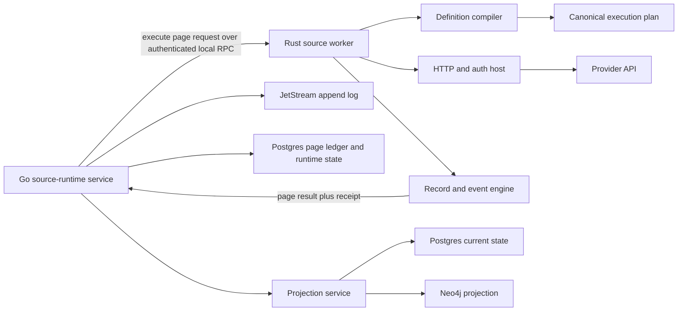

# ADR: Native Rust Source Runtime

- **Status:** Proposed
- **Date:** 2026-07-15
- **Base decision:** [`rust-control-kernel-carve.md`](rust-control-kernel-carve.md)
- **Related boundaries:** [`non-goals.md`](non-goals.md), [`source-cdk-extraction.md`](source-cdk-extraction.md), [`durability-contract.md`](durability-contract.md)

## Decision

Cerebro will add a native Rust source-runtime process that executes normalized connector definitions and returns validated source pages to the existing Go compatibility plane. The unit of connector authoring becomes a versioned, language-neutral definition and proof bundle, not a generated Go package.

This is the target boundary, not permission to translate working Go packages. The
native worker advances only when an implementation slice deletes an existing
ownership surface or proves a safety property that the current Go path leaves to
runtime checks and review.

The first Rust runtime owns shared provider execution:

- definition validation and compilation into a canonical execution plan;
- endpoint construction and egress policy enforcement;
- authentication, token caching, request signing, retries, and rate-limit handling;
- pagination, fan-out, incremental cursors, checkpoints, and freshness probes;
- provider-record decoding, field selection, redaction, stable identity, and event construction;
- event-contract validation and bounded execution receipts.

The Go compatibility plane remains authoritative for:

- source-runtime configuration and secret resolution;
- runtime leases and page-attempt ownership;
- append-log publication and dead-letter recovery;
- checkpoint and current-state commits in Postgres;
- graph and current-state projection writes;
- existing HTTP, Connect, CLI, SDK, and MCP compatibility surfaces.

This is a runtime-boundary migration. It is not a connector-by-connector translation project, a second persistence path, or a third-party plugin marketplace.

## Customer outcome

An operator should be able to add or deepen a source without waiting for a new hand-written runtime loop. A source is ready when Cerebro can prove, from fixtures and bounded provider probes, that it:

1. authenticates with the declared mechanism;
2. reaches every declared resource family;
3. resumes without skipping or duplicating provider state;
4. emits stable tenant-scoped identities and contract-valid events;
5. projects the intended entities and relationships;
6. reports missing scope, permission, rate-limit, and provider failures as distinct states;
7. can be replayed and compared before it becomes authoritative.

The visible product state is not “connector installed.” It is a source runtime with explicit family coverage, last successful observation, current checkpoint, rejected-record count, projection result, and a proof revision.

## Why this decision exists

The repository already contains the correct beginnings of a scalable source model:

- `internal/connectordefinitions.Definition` is a versioned connector manifest.
- `sources/internal/catalogruntime` turns a normalized definition into an executable JSON API source.
- `sources/internal/jsonapi` centralizes common auth, HTTP, pagination, fan-out, record selection, and event mapping.
- `internal/sourcecdk.Source` defines `Check`, `Discover`, and paged `Read` operations.
- `internal/sourceruntime.Service.Sync` owns the append, projection, checkpoint, quarantine, and page-commit sequence.
- `internal/sourceprojection` turns events into state and graph records outside source packages.
- `internal/sourcegen` and the connector catalog already produce proof and promotion artifacts.

The problem is not the absence of a connector factory. The problem is that the factory still materializes too much Go source and too much compile-time wiring.

The current repository snapshot, measured with `tools/codegenstatus` and
`tools/sourcefidelity`, contains:

- 794 connector definitions;
- 793 definitions accepted by the normalized generator grammar;
- one definition classified as requiring a bespoke runtime;
- 16 shared projection templates;
- 820 entries in the source-fidelity inventory and 799 runtime sources;
- 43 sources at the current high-fidelity threshold;
- 743 sources that still need realistic fixtures;
- 736 sources that still need every-family tests;
- 752 sources that still need deploy-family coverage;
- a 5,827-line compile-time source registry;
- a 6,407-line compile-time projector registry;
- generated adapters that repeat large maps of paths, selectors, identity keys, and static attributes already present in connector definitions.

Moving each package to Rust would preserve that shape and create a large Rust workspace with the same registration, fidelity, and review problems. The useful Rust boundary is the shared execution engine under the declarative catalog.

## Proven boundary in the current tree

The repository now contains a smaller executable proof in
`internal/sourceruntime/recordkernel`. It deliberately leaves credentials,
provider requests, retries, leases, append, projection, and checkpoint commits
in Go. A bounded Rust/Wasm guest receives one credential-free page and mapping
contract, then returns accepted records, quarantine references, a proposed
cursor, and deterministic receipts.

That proof establishes the first reusable primitives:

- an unvalidated plan cannot execute because the executable method exists only
  on the validated Rust type;
- an execution permit is move-only and cannot authorize a second call;
- host encoding, guest input, guest output, memory, and execution time are
  bounded before any result is accepted;
- the guest has zero function imports and zero memory imports;
- empty cursor-only pages map successfully;
- malformed signed limits return bounded contract rejections instead of being
  reported as worker failures;
- native and embedded tests prove stable output across JSON object key order;
- the canonical artifact and its ABI, hash, and size are checked in the shared
  embedded-Wasm manifest.

It does not establish that provider HTTP, authentication, retry, or pagination
should move to Rust. Those capabilities already work in Go. This ADR requires
the later native worker to earn that larger boundary through registry deletion,
definition-driven coverage, failure isolation, and live differential evidence.
If it cannot, Cerebro keeps provider transport in Go and expands only the
credential-free record kernel.

## Why Rust, and where Rust is not the reason

The decision is narrower than “Rust is safer”:

| Boundary rule | Rust property | Go position | Decision consequence |
| --- | --- | --- | --- |
| A draft plan cannot execute | typestate exposes execution only on `SourcePlan<Validated>` | standard Go methods cannot depend on a compile-time state parameter | keep plan compilation and validation in Rust |
| One grant authorizes one execution | ownership makes the permit move-only | standard Go has no user-defined move-only value | consume execution authority inside Rust |
| Internal state additions reach every handler | closed enums and exhaustive Rust matches | Go wire consumers still validate string states at runtime | use Rust enums internally; validate every cross-language state at the ABI |
| Mapping code has no ambient capabilities | the committed Wasm guest has no imports | the pinned standard Go Wasm runtime imports WASI process services | keep agent-written mapping inside the no-import guest |
| Provider HTTP, auth, retries, and pagination work | no unique language advantage | the existing Go hosts already implement these operations | move them only when one native worker deletes duplicated runtime ownership |
| A crash is isolated from the API process | separate process boundary | a separate Go process can provide the same isolation | process isolation alone does not justify a rewrite |

The Rust-specific case is compile-time authority and state discipline around
untrusted, frequently changed mapping and plan logic. The native-process case is
operational consolidation. They are related but they are not the same claim.

## Current execution path

Today a source-runtime sync follows this sequence:

```text
stored SourceRuntime
  -> acquire source implementation from registry
  -> resolve secret-backed config
  -> Read or ReadWithCheckpoint
  -> materialize tenant/runtime fields
  -> validate the EventEnvelope
  -> validate catalog event contracts
  -> quarantine contract-invalid records
  -> begin page-attempt ledger entry
  -> append the accepted event page to JetStream
  -> project each event into current state and graph
  -> commit checkpoint, next cursor, and runtime status
```

This ordering is load-bearing. The Rust runtime replaces only the provider-execution segment. It does not move append, projection writes, or checkpoint commit across the process boundary in the first release.

## Architectural shape



The process runs as a native Linux service. There is no CGO, `dlopen`, or in-process Go/Rust FFI. Local deployments may use a Unix-domain socket. Distributed deployments may use mutually authenticated Connect or gRPC. Both modes use the same protobuf contract and require a short-lived runtime capability.

## Ownership boundaries

### Rust source worker

The worker owns deterministic and provider-facing work that can be retried without committing platform state:

- parse a canonical execution plan;
- validate the plan before any network request;
- validate resolved configuration against the plan's config schema;
- derive the exact provider request for one operation and page;
- enforce scheme, host, port, redirect, DNS, and response-size policy;
- obtain or refresh provider credentials without persisting them;
- execute bounded requests under the request deadline;
- classify provider failures using a stable error taxonomy;
- decode one response page;
- compute the next provider cursor and proposed checkpoint;
- map records into canonical event envelopes;
- validate required attributes, required payload fields, identity fields, and schema references;
- deduplicate events within the page;
- return a page receipt with content digests and execution measurements.

The worker does not know how to write JetStream, Postgres, or Neo4j. It does not advance a durable checkpoint. It does not decide whether a page owns a lease. It cannot declare projection success.

### Go compatibility plane

The compatibility plane owns stateful coordination:

- load a stored runtime under its tenant;
- acquire and renew its lease;
- resolve credential references through the existing resolver;
- issue one bounded capability for one runtime operation;
- call the worker with the current durable checkpoint and page cursor;
- independently validate the returned envelope and receipt;
- write the page attempt and outbox state;
- publish accepted events;
- project the events;
- atomically commit runtime progress;
- preserve existing API behavior and redaction.

The Go caller may retry an identical page request. The worker must return the same logical page for the same execution-plan digest, input cursor, checkpoint, scope, and provider response.

### Projection boundary

Sources still do not write graph records. Initially the Rust worker emits the existing `cerebro.v1.EventEnvelope`. Existing Go projectors remain authoritative.

A later phase may move deterministic event-to-projection calculation into Rust. If it does, Rust returns a `ProjectionDelta` containing normalized entities, links, and retractions. Go remains the only writer to Postgres and Neo4j. The delta is validated and can be recomputed from the appended event.

## Canonical connector definition

YAML remains an authoring format, not a runtime ABI. A build-time compiler normalizes `connectordefinitions.Definition` into `SourceExecutionPlanV1`, serialized with deterministic protobuf encoding and identified by a SHA-256 digest.

The execution plan contains:

| Section | Required content |
| --- | --- |
| Identity | schema version, source ID, definition revision, plan digest |
| Configuration | public fields, secret-reference fields, required fields, validation rules |
| Egress | allowed schemes, provider hosts, base-path constraints, redirect policy, private-endpoint policy |
| Authentication | auth model, header/signature rules, token endpoint, scopes, cache partition keys |
| Families | family ID, method, path template, request bindings, response selector |
| Pagination | cursor kind, input binding, output selector, termination rule, page-size limit |
| Incremental state | opaque cursor or high-watermark semantics, overlap policy, reconciliation interval |
| Identity | provider ID selectors, canonical encoding rule, URN kind, fallback prohibition |
| Events | kind, schema reference, payload selection, required fields, stable attributes |
| Projection intent | template, entity identity fields, relationships, retraction keys |
| Coverage | dimensions, support level, evidence types, control domains |
| Limits | request count, response bytes, records per page, wall time, fan-out cardinality |
| Proof | fixture digests, provider-contract lock digest, generator revision, review state |

Runtime execution never consults unnormalized YAML maps. Unknown plan fields are rejected unless the schema revision explicitly declares forward-compatible handling.

## Source execution protocol

The new internal protocol will be defined in
`proto/cerebro/v1/source_runtime.proto` and generated for both Go and Rust. It
is not exposed as a new public route in the first phase.

### Operations

The worker supports four operations:

- `DescribePlan`: return plan identity, supported families, and capability requirements.
- `Check`: validate configuration and execute the declared verification request.
- `Discover`: return bounded URNs for one family or declared scope.
- `ReadPage`: return one page of events, a proposed checkpoint, and a receipt.

There is no `Sync` operation in the worker. Sync owns durable state and remains in the compatibility plane.

### ReadPage request

`ReadPageRequest` carries:

- protocol and execution-plan versions;
- plan bytes or a previously registered plan digest;
- tenant, runtime, source, and family IDs;
- unique page-attempt ID and idempotency key;
- current durable checkpoint and provider continuation cursor as separate values;
- resolved public config values;
- resolved secret values in a separately redacted field set;
- source scope and path-parameter values;
- request deadline and hard resource limits;
- capability token binding the caller to the exact runtime, source, family, and operation;
- optional trace context.

The capability token cannot authorize another source, family, tenant, runtime, or operation. The worker rejects an expired token before resolving a provider URL.

### ReadPage result

`ReadPageResult` carries:

- the same tenant, runtime, source, family, attempt, and idempotency identities;
- execution-plan digest and worker build identity;
- ordered event envelopes;
- next provider cursor, when more provider pages exist;
- proposed checkpoint and watermark;
- short-circuit and reconciliation reasons;
- scanned, accepted, and rejected record counts;
- bounded rejection summaries without raw sensitive payloads;
- provider revision, ETag, or response digest when available;
- request count, response bytes, retry count, and rate-limit observations;
- a canonical digest over the logical result;
- a worker receipt signed or authenticated by the process identity.

The result never includes an access token, client secret, cookie, authorization header, or unredacted rejected record.

## Cursor and checkpoint rules

The current code correctly treats page continuation and durable progress as different concepts. The Rust boundary preserves that distinction.

- A cursor resumes the next provider page in the current run.
- A checkpoint is a proposed durable watermark after accepted events are committed.
- The Go caller sends the same original durable checkpoint across pages in one bounded sync when the source needs it for incremental filtering.
- The worker may propose a checkpoint but cannot commit it.
- Empty pages may carry a next cursor.
- A not-modified response may refresh checkpoint metadata without emitting events.
- A high-watermark source must declare overlap and equality behavior.
- The existing Go-compatible continuation cursor remains opaque and is
  persisted unchanged in `NextCursor` during migration. Depending on the
  source, that value may be a provider-native token or an existing Cerebro
  composite that includes fan-out position and nested provider state. The
  execution plan declares its format but does not wrap it in a Rust-only value.
- Source, family, plan digest, engine, and cursor-schema identity are stored as
  separate progress metadata. Go validates that metadata before it sends the
  exact Go-compatible continuation cursor to either engine.
- Worker-only continuation state, when required, uses a separate versioned
  field. It cannot replace `NextCursor` and is never passed to a Go source as a
  continuation token.
- A new cursor representation requires an explicit converter back to the exact
  Go-compatible continuation value plus differential resume and rollback
  fixtures before that family can become authoritative.
- Reconfiguration that changes progress-affecting fields invalidates incompatible continuation state through the existing configuration digest rule.

## Identity and event rules

Provider display names are not identities. Each family declares stable provider ID selectors and one canonical encoding rule.

The worker rejects a record when:

- no declared stable ID is present;
- two declared identities disagree under a family rule that requires equality;
- the canonical ID or resulting URN exceeds its bound;
- provider-controlled delimiters would produce an ambiguous identity;
- required tenant, source, family, event, or schema fields are missing;
- the event kind does not belong to the plan;
- required attributes or payload fields are absent;
- an event ID collides with a different canonical payload in the same page.

The existing event envelope remains the append-log contract during migration. Rust and Go validators share a generated contract corpus and must produce the same accept/reject decision and error category.

## Configuration and secret handling

The existing string map is preserved at the public compatibility surface but is not the worker's internal model.

The plan compiler assigns every field one of these classes:

- public runtime configuration;
- secret reference;
- resolved ephemeral secret;
- progress-affecting configuration;
- scope configuration;
- endpoint override;
- test-only configuration.

The Go plane resolves secret references and sends resolved values only for one bounded call. Rust wraps secret values in non-printing, zeroizing types. Secrets are excluded from traces, errors, receipts, panic output, and result digests. Cache keys use keyed digests, never raw credentials.

Endpoint overrides remain fail-closed. The worker applies the same private-endpoint policy to verification, token, list, detail, pagination-next, and redirect URLs. A provider response cannot move the worker to an undeclared host through a `Link` header or next-URL field.

## HTTP, auth, and egress host

Provider I/O is centralized in one Rust host instead of repeated in generated source packages.

The host enforces:

- HTTPS by default;
- an execution-plan host allowlist;
- bounded DNS resolution and rebinding protection;
- redirect count and cross-host redirect policy;
- connection, request, idle, and total operation deadlines;
- response-body and decompression limits;
- bounded concurrency per runtime and provider host;
- retry budgets driven by error class and idempotent method;
- `Retry-After` handling with an upper bound;
- token cache partitioning by tenant, source, auth mechanism, client identity, scope, and secret digest;
- explicit support for declared auth models only;
- response content-type and JSON-depth limits;
- telemetry labels with bounded cardinality.

Provider-specific signing or SDK behavior is implemented as a typed host capability, not copied into a connector definition as executable text.

## Error contract

Every worker failure returns a stable category plus bounded details:

| Category | Retry disposition | Example state |
| --- | --- | --- |
| `invalid_plan` | never | definition cannot execute |
| `invalid_config` | after operator change | required configuration missing |
| `unauthorized` | after credential change | provider rejected credentials |
| `permission_denied` | after scope change | family is not visible to the credential |
| `rate_limited` | after declared delay | provider budget exhausted |
| `provider_unavailable` | bounded retry | upstream 5xx or network failure |
| `decode_failed` | after contract change | response does not match selector |
| `invalid_record` | quarantine record | stable identity or event contract failed |
| `cursor_invalid` | restart or migration path | continuation state is incompatible |
| `budget_exhausted` | split or reduce scope | records, bytes, fan-out, or time exceeded |
| `cancelled` | caller decision | lease lost or request cancelled |
| `internal` | no blind retry | worker invariant failed |

Raw provider bodies and secrets are never error details. The result may include a bounded field path, HTTP status, provider request ID, and contract revision when safe.

## Determinism and idempotency

The worker is not assumed to control provider consistency. It is required to make its own transformations deterministic.

For a fixed plan, input, and provider response bytes:

- event order is stable;
- map serialization is canonical;
- event IDs, URNs, and result digests are stable;
- timestamps come from declared provider fields or an explicit observation time supplied by the caller;
- retries do not create new logical event identities;
- duplicate records within a page collapse by event ID only when their canonical payload digest matches;
- conflicting duplicates fail the page or quarantine the record according to the family contract.

The page-attempt ID identifies one durable Go commit attempt. The idempotency key identifies one logical worker execution. Neither is derived from a wall-clock timestamp alone.

## Projection evolution

Projection is included in this ADR because source fidelity is incomplete until provider records become useful graph facts.

### Phase A: existing event envelope, existing Go projection

Rust emits existing events. Go projection remains unchanged. Differential tests compare Go- and Rust-produced events before any graph comparison.

### Phase B: compiled projection plan in shadow

The same connector definition compiles to a projection plan. Rust computes normalized entities, links, and retractions without writing them. Tests compare the delta with existing Go projectors and verify tenant scope, identity, attributes, and deletion semantics.

### Phase C: Rust projection calculation, Go projection writes

After parity, Go may accept the Rust delta for declarative families. Go validates and writes it through existing state and graph ports. Hand-written deep projectors stay in Go until a whole projector family has a measured migration case.

No phase permits direct graph writes from the worker.

## Source tiers after the carve

### Declarative source

The default source is a normalized definition, fixtures, provider-contract lock, projection plan, coverage contract, and proof bundle. It contains no handwritten runtime loop.

An agent can propose a declarative source, but promotion requires deterministic validation, fixture replay, contract proof, and the existing review gates. A model does not get to invent provider fields and mark them certified.

### Deep source

A small number of providers require SDKs, multi-service discovery, request signing, or relationship traversal that the declarative engine cannot express safely.

Deep sources use typed Rust extension traits compiled into the first-party worker binary. They remain repository-owned, versioned, and held to the existing Depth Contract. They do not get raw storage clients or an unrestricted network client; they call the same bounded egress, auth, pagination, event, and receipt hosts as declarative sources.

The first release does not load arbitrary native libraries or third-party images.

### Component extension, later

WASI components are a possible future distribution boundary for first-party deep adapters. They are not part of the initial decision. Before component loading is allowed, a separate implementation proposal must define:

- signed artifact identity and provenance;
- WIT version negotiation;
- host-call capability grants;
- egress and secret isolation;
- CPU, memory, request, and output limits;
- component revocation and rollback;
- compatibility and differential test policy.

The native worker must prove the execution contract before the repository adds component lifecycle complexity.

## Agentic source development loop

The intended development loop is a sequence of typed artifacts and receipts:

1. **Observe:** ingest an official API specification or operator-supplied documentation reference.
2. **Propose:** produce a connector definition with explicit auth, families, identities, pagination, projection, and coverage.
3. **Compile:** normalize it into `SourceExecutionPlanV1`; reject unsupported grammar.
4. **Generate tests:** create fixture requests and responses for check, discover, first page, continuation, empty page, permission failure, rate limit, and malformed record.
5. **Replay:** execute the fixtures against Go and Rust engines and compare canonical page digests.
6. **Probe:** run bounded sandbox requests with an operator-provided credential and capture redacted proof receipts.
7. **Explain gaps:** identify missing families, scopes, fields, relationships, and lifecycle behavior.
8. **Promote:** move the plan through draft, sandbox, pilot, approved, and certified gates.
9. **Watch:** compare runtime success, quarantine, freshness, cursor, and projection behavior.
10. **Reopen:** automatically return the source to a lower gate when provider-contract drift or differential mismatches appear.

Agents may author definitions, fixtures, mappings, and explanations. Agents may not mark a provider contract reviewed, approve new egress, resolve a secret, widen a capability, or bypass a failed proof gate.

## Control-kernel integration

The source worker is the observation side of the native control loop. It does not become another agent or scheduler.

```text
mandate desired condition
  -> required coverage and freshness
  -> source-runtime observation request
  -> Rust page execution and source receipt
  -> Go append, projection, and checkpoint commit
  -> durable source revision
  -> mission scope, decision, action, or verification wake
```

The control kernel may request a source operation through an authenticated Go compatibility API. It never sends provider credentials to a model and never calls the worker directly with wider authority than the stored runtime permits.

Each committed source page produces a reusable observation reference containing the runtime ID, source ID, family, plan digest, durable checkpoint revision, event digest, projection result, and completion time. Mission state stores the reference, not a copy of provider payloads.

This enables several closed loops:

- a mandate declares required source families and maximum observation age;
- missing or stale coverage blocks a mission with a concrete wake condition;
- source health schedules a bounded collection request instead of prompting a model to guess;
- a newer committed source revision wakes a blocked or verifying mission;
- action verification requires a post-action revision and an independent observation receipt;
- provider-contract drift opens definition-repair work and lowers source authority;
- repeated quarantine or projection mismatch suspends that family from verified closure;
- coverage expansion can reopen missions whose original scope was incomplete.

Source health is not inferred from one successful HTTP response. The kernel consumes the committed Go runtime state after append and projection. A worker receipt proves execution; it does not prove durable visibility or control effectiveness.

The first integration should expose these typed wake conditions:

- `source_revision_advanced`;
- `source_freshness_restored`;
- `source_scope_expanded`;
- `source_contract_drifted`;
- `source_quarantine_threshold_exceeded`;
- `source_projection_caught_up`;
- `source_capability_unavailable`.

These are mission observations, not new finding types. Existing finding rules continue to decide whether current source state represents a durable remediable gap.

## Deposit ingest

Connector definitions already distinguish pull execution from connector-scoped deposit ingest. The native worker does not expose a public push endpoint.

Go remains responsible for authenticating and authorizing deposit callers. After authentication, the same plan compiler and Rust record engine may be used as a pure `ValidateDepositBatch` operation to enforce family identity, payload, event, redaction, and projection contracts before Go appends the batch.

For full-state deposits, the request must include a stable deposit revision, batch sequence, completeness declaration, and idempotency key. Retractions are calculated only after the final batch for that revision is durably committed. An incomplete upload cannot delete previously visible state.

This reuses one contract without erasing the trust distinction between Cerebro-initiated provider pulls and authenticated first-party deposits.

## Contract and code generation changes

`internal/sourcegen` changes from “generate a Go package” to “compile a definition and produce proofs.” Existing Go generation remains available only as a migration and differential-test target.

The canonical pipeline becomes:

```text
provider evidence
  -> connector definition
  -> normalized execution plan
  -> generated Go and Rust bindings
  -> fixture corpus
  -> execution proof
  -> projection proof
  -> signed promotion receipt
```

Registration becomes data-driven. The runtime loads the compiled first-party plan index instead of importing every standard source package. The plan index is deterministic, checked into release provenance, and validated before serving traffic.

## Migration plan

### Stage 0: bounded mapping proof and contract extraction

- Keep the landed no-import record kernel credential-free and non-authoritative.
- Use its typestate, permit, canonicalization, quarantine, receipt, ABI, host
  limits, and artifact-manifest checks as the minimum contract for later plans.
- Add `source_runtime.proto` with plan, request, result, receipt, limit, and error types.
- Generate Go and Rust bindings in CI.
- Add canonical serialization and digest test vectors.
- Add a Go adapter from existing `Source` calls to the new request/result contract.
- Do not add network transport yet.

**Exit gate:** Go round-trips representative sources through the new contract
without behavior changes, and the credential-free kernel can shadow recorded
pages without changing append or checkpoint authority.

### Stage 1: definition compiler

- Add a pure Rust `source-contract` crate.
- Compile normalized connector definitions into execution plans.
- Run the existing catalog grammar corpus against Go and Rust compilers.
- Reject any field whose runtime behavior is not represented in the plan.
- Produce plan digests and compatibility reports.

**Exit gate:** every generateable catalog definition either compiles identically or reports one explicit unsupported grammar feature.

### Stage 2: fixture executor

- Add the native `source-worker` process.
- Implement check, read-page, auth, cursor, record, event, and receipt logic against local fixtures.
- Add property tests for pagination termination, cursor round trips, identity encoding, redaction, and event validation.
- Add fuzz corpora from existing source fixtures without storing sensitive provider data.

**Exit gate:** selected declarative families produce the same accepted events, quarantines, cursors, and checkpoints as Go.

### Stage 3: live shadow

- Let Go call both engines for allowlisted runtimes.
- Only Go output is committed.
- Compare request intent, page digest, event digest, cursor, checkpoint, error class, and projection preview.
- Store bounded mismatch receipts in existing current state; do not add another datastore.

**Exit gate:** the pilot cohort meets the parity and operational gates below for the required observation window.

### Stage 4: authoritative declarative pages

- Select authority per source family, not per entire deployment.
- Rust returns the authoritative page; Go retains append, projection, and commit.
- Automatic rollback changes the family back to Go on parity, crash, latency, or quarantine thresholds.
- Go shadow execution remains available for a bounded rollback window.

**Exit gate:** no source-specific Go runtime loop is needed for the authoritative declarative cohort.

### Stage 5: registry and generator deletion

- Stop generating Go packages for standard declarative sources.
- Replace compile-time standard-source imports with the plan index.
- Delete sourcegen wiring that exists only to render Go maps and registration calls.
- Keep deep sources and compatibility adapters explicit.

**Exit gate:** adding a standard source changes a definition, fixtures, proof, and plan index; it does not change a language registry.

### Stage 6: projection calculation

- Compile declarative projection plans in Rust.
- Run projection deltas in shadow.
- Move authoritative calculation only after differential and replay gates pass.
- Keep all state and graph writes in Go.

### Stage 7: deep Rust sources

- Define the typed deep-source extension trait.
- Move one complete provider boundary only when it reduces shared complexity or unlocks required SDK behavior.
- Do not translate deep sources for language-percentage goals.

## Release gates

### Contract gates

- Protobuf compatibility checks pass for Go and Rust.
- Canonical plan and result digests match committed vectors.
- Unknown schema revisions fail closed.
- Go and Rust validators agree on the fixture corpus.
- Plan compilation is reproducible from a clean checkout.

### Correctness gates

- First, middle, final, and empty-page behavior match.
- Cursor and checkpoint behavior match across restarts.
- Not-modified and forced-reconciliation behavior match.
- Duplicate events cannot advance a checkpoint twice.
- Conflicting duplicate IDs fail safely.
- Invalid records do not enter the append log.
- Contract drift increases quarantine and lowers source promotion state rather than silently changing identity.
- Projection replay from appended events remains deterministic.

### Security gates

- Cross-tenant runtime, plan, cursor, and credential reuse fails closed.
- Expired or mismatched worker capabilities fail before egress.
- Redirects and next URLs cannot escape declared hosts.
- DNS rebinding and private-address policy tests pass.
- Secrets do not appear in logs, traces, errors, receipts, crash output, or digests.
- Response and decompression limits are enforced before allocation growth.
- Provider-controlled identifiers cannot create URN collisions.
- Deep extensions cannot access storage or unrestricted networking.

### Operational gates

- Worker crash does not advance durable progress.
- Lease loss cancels work and prevents commit.
- Repeating a page attempt does not duplicate durable events.
- Go continues serving existing source APIs while the worker is unavailable.
- An unavailable Rust worker produces an explicit capability state; it does not silently report success.
- Per-family rollback does not require rewriting stored checkpoints.
- Every authoritative family proves that Rust-to-Go rollback resumes from the
  stored Go-compatible continuation cursor without wrapping, truncating, or
  resetting it.
- CPU, memory, latency, request, and response budgets are observable.
- Worker version and execution-plan digest are visible in internal runtime diagnostics.

### Fidelity gates

- Realistic check, discover, and read fixtures exist.
- Every declared family has a success and failure case.
- Provider field identity and pagination have reviewed evidence.
- Projection entities and relationships match the declared coverage contract.
- Lifecycle and retraction behavior is explicit for stateful families.
- A provider success response alone cannot certify a source.

## Rollout and rollback

Authority is selected with a stored, tenant-scoped runtime flag containing the engine, plan digest, and minimum worker version. The default remains Go until a family passes live shadow.

Rollback is a state transition, not a deployment improvisation:

1. stop issuing Rust page capabilities for the affected family;
2. preserve the last committed checkpoint, Go-compatible continuation cursor,
   and progress metadata;
3. validate the stored source, family, plan, engine, and cursor-schema metadata,
   then pass the exact Go-compatible continuation cursor to the Go adapter;
4. keep the mismatch receipt and worker build identity;
5. require a new plan or worker revision before Rust can regain authority.

No rollback deletes events, rewrites graph state, or resets progress unless an operator explicitly starts the existing replay or resync path.

## Observability

The worker emits bounded metrics and traces for:

- operation, source family, result category, and worker build;
- plan compilation success and unsupported grammar;
- request, retry, rate-limit, response-byte, record, event, and quarantine counts;
- cursor kind and checkpoint-advanced boolean;
- page and projection digest parity;
- capability denial and egress-policy denial;
- panic, crash, timeout, cancellation, and budget exhaustion.

Tenant IDs, runtime IDs, provider object IDs, URLs, credentials, payloads, and raw errors are not metric labels.

The Go sync span remains the parent operation because it owns durable completion. Worker completion is not source-sync completion.

## Alternatives considered

### Translate every source package to Rust

Rejected. It moves code without changing the authoring, registry, fidelity, or projection model. It would create hundreds of crates and preserve generated mapping repetition.

### Keep Go source execution indefinitely

Retained as the fallback, rejected as the default target. The existing catalog
runtime proves that most standard sources are data-driven. Keeping execution
tied to generated Go packages preserves compile-time registries and makes the
catalog harder to operate through definitions and proofs. But Go remains the
provider runtime if the native worker cannot delete those surfaces or meet the
parity and operational gates in this ADR.

### Use CGO or in-process FFI

Rejected. Panics, allocator behavior, cancellation, dependency upgrades, and process failure would cross the API boundary. The service carve needs independent rollout and rollback.

### Make each source a container

Rejected for the standard tier. Hundreds of images multiply signing, scheduling, patching, observability, and secret-delivery work. One worker with bounded execution plans is the smaller operational surface.

### Start with WASI components

Deferred. Components may become useful for first-party deep adapters, but starting there would add an ABI and artifact lifecycle before the core page contract is proven.

### Let Rust append events and write projections

Rejected for the migration. It would move provider execution, durability, and projection authority simultaneously and create two commit paths. Rust earns each boundary through replay and parity gates.

### Replace protobuf with a Rust-native schema

Rejected. Existing events and APIs are protobuf contracts. A language-specific wire model would make compatibility harder and duplicate schema governance.

## Consequences

### Positive

- Standard source additions become definition-and-proof changes.
- Shared HTTP, auth, pagination, identity, and validation behavior has one implementation.
- The API process no longer needs to compile every standard source adapter.
- Provider execution can be rolled out and budgeted independently.
- Agents can iterate on typed source artifacts and receive machine-checkable failures.
- Go and Rust differential execution creates a safe migration oracle.
- Projection calculation can move later without moving graph writes.

### Costs

- The deployment gains one first-party process.
- Go and Rust bindings and compatibility tests must stay synchronized.
- Live shadow doubles provider reads unless the pilot uses captured responses or safe allowlisted operations.
- Secret transit and local process authentication become explicit responsibilities.
- The team must operate per-family authority and rollback state.
- Some deep providers will remain Go for a long time.

## First implementation stack

The implementation should land as reviewable ownership slices based on the native control-kernel foundation:

1. **Bounded record kernel:** landed typestate, move-only permit, no-import ABI,
   host limits, empty-page behavior, quarantine, receipts, and reproducible
   artifact evidence.
2. **Source protocol:** protobuf contract, canonical digest vectors, Go adapter, Rust generated types.
3. **Plan compiler:** Rust definition normalization and catalog grammar parity.
4. **Fixture worker:** native process, bounded HTTP host, auth, pagination, events, receipts.
5. **Differential harness:** Go/Rust page and projection comparison over existing fixtures.
6. **Live shadow:** capability issuance, UDS or mTLS transport, mismatch receipts, metrics.
7. **Control-loop receipts:** committed source revisions and typed mission wake conditions.
8. **Family authority:** one declarative cohort with automatic rollback.
9. **Registry deletion:** plan-index loading and removal of standard generated registration.
10. **Projection delta:** shadow calculation and later authoritative declarative projection.
11. **Deposit validation:** shared record validation behind the existing authenticated deposit surface.

No slice should combine process transport, authoritative provider reads, append ownership, and graph writes.

## Open questions that do not block the first slice

- Whether distributed deployments standardize on Connect or gRPC once the protobuf contract exists.
- Whether plan bytes are sent on every request or registered by digest with a bounded worker cache.
- Which keyed-digest mechanism identifies secret cache partitions.
- Which small source-family cohort provides the best live-shadow coverage without expensive provider reads.
- Whether a future first-party component model uses WIT or only the native deep-source trait.
- When declarative projection parity is strong enough to remove generated Go projectors.

These choices do not change the initial ownership line: Rust performs bounded provider execution; Go owns durable commit and graph writes.

## Review trigger

Revisit this decision if one of these becomes true:

- the normalized connector grammar cannot express a meaningful majority of standard sources without embedded code;
- cross-process overhead consumes a material share of source-sync latency or provider budget;
- Rust and Go cannot share the event and checkpoint contract without lossy conversion;
- operating the worker creates more incidents than it isolates;
- a smaller boundary demonstrates equivalent source fidelity, rollout safety, and agentic authoring.

Until then, new standard source capability should extend the language-neutral execution plan and shared Rust host rather than add another generated runtime loop.
