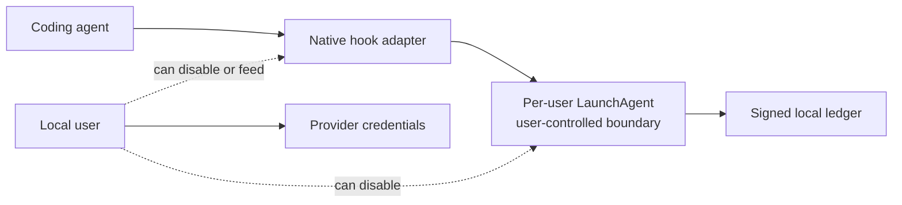
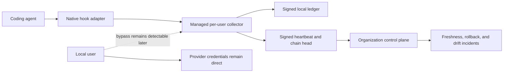
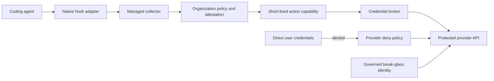

# Security Hardening Proposal: Move shield trust off the user-controlled endpoint

## Decision

Choose how Cerebro should turn persistent local agent evidence into a security control that an organization can measure and, for selected actions, enforce.

## Executive Recommendation

The complete choice is Option 1, **Managed endpoint attestation**, or Option 2, **Brokered provider enforcement**. I recommend Option 1 as the next deployed vertical because it gives the security team a fleet denominator and detects stale, rolled-back, or missing endpoint evidence without putting a new service in every action path. Option 2 should become mandatory for an action family once the organization decides that preventing it is worth a fail-closed broker dependency.

## Evidence

I inspected the source locations below and ran the experiment recorded in E001. E001 most influenced the recommendation because it proves the local design is reliable enough to build on while making no claim that it resists its owning user.

| Evidence | Finding or document | What it establishes |
| --- | --- | --- |
| `E001` | [Background collector recovery](../../../CANARY.md) | The collector queues during a freeze, recovers exactly once, survives the status app, and restarts under launchd. |
| `E002` | [LaunchAgent runtime](../../../Sources/CerebroShieldAgent/main.swift) | XPC admits the same effective user; the collection boundary is per-user. |
| `E003` | [Investigation capability verifier](../../../Sources/ReceiptCore/AdminCapability.swift) | Organization access is signed, short-lived, device-bound, role-scoped, operation-bound, and target-bound; adapter mutations also record the grant ID in a local single-use ledger. |
| `E004` | [Documented security boundary](../../../README.md) | Hook evidence is an agent-supplied claim and provider prevention requires an independent authority. |

The observed claims are E001 through E003. The structural conclusion in E004 is inferred from those ownership boundaries: a signer inside the same user's session can make stored records tamper-evident after capture, but it cannot prove that every relevant action reached capture.

## Current Design And Failure Mode

The native hook sends a minimized draft to a per-user LaunchAgent. That process owns the signing key, append-only chain, adapter repair, and bounded fallback drain. This is materially better than a window-bound app: capture survived UI termination and collector restart in E001.

What gives me pause is authority, not process uptime. The same user can invoke a compatible hook input, disable an adapter, or disable the LaunchAgent. Binary identity tells us which artifact ran and whether it drifted; it does not prove who authorized an investigation or whether all actions were observed. Without an independent checkpoint, an absent ledger can look the same as an inactive device. Without provider deny, direct credentials can mutate the provider without asking the endpoint control.

## Desired Invariants

- Every enrolled device reports a signed, monotonic chain head and heartbeat within policy freshness.
- A missing, replayed, rolled-back, or conflicting checkpoint creates an organization-visible incident.
- Investigation actions require a server-issued capability bound to organization, device, subject, grant ID, canonical operation, canonical target, and an expiry of at most one hour.
- Protected provider mutations are denied unless a dedicated broker supplies the required action identity.
- Break-glass actions remain visible in the provider-event denominator and receive explicit review.

## Constraints And Non-Goals

The hook path must stay local and bounded during network outages. We do not have production broker latency, endpoint RSS, fleet offline patterns, or service ownership evidence, so the proposal includes measurement gates instead of invented budgets. Endpoint Security is not the first move: it adds entitlement, system-extension, notarization, MDM, and privacy costs without solving direct provider credentials. It becomes relevant only if a selected local process class must be intercepted rather than observed.

## Before Architecture

The current boundary keeps all trust on the endpoint and leaves provider credentials direct.

The important edges are the two dotted same-user controls and the direct provider path. Improving binary diffs does not remove either edge.

## Options

### Option 1: Managed endpoint attestation

The attractive part of this option is that it preserves the working local path. A signed managed build enrolls its device identity, sends asynchronous heartbeats and chain heads, and receives short-lived investigation capabilities only after enterprise authentication and server policy. The control plane computes fleet coverage and creates incidents for stale, replayed, rolled-back, or conflicting state.

This narrows the security problem from “we do not know whether the sensor exists” to “we know which enrolled sensors are fresh.” It does not make hook inputs authentic against the owning user and does not stop direct provider credentials. That residual risk must stay visible in product copy and policy.

| Change | Before | After | Security consequence | Cost |
| --- | --- | --- | --- | --- |
| Device state | Local only | Enrolled heartbeat and chain head | Missing and rollback states become visible | Enrollment and incident service |
| Investigation access | Local UI state | Signed device-bound capability | Groups and hashes cannot grant local access | Issuance and rotation |
| Network path | None for capture | Asynchronous checkpoint | Hook latency stays independent | Retry queue and offline policy |

Performance and memory should remain close to neutral because only a bounded envelope and asynchronous request are added. Reliability improves for organizational visibility but adds retry and false-stale failure modes. Migration is additive for managed devices; rollback disables checkpoint delivery without removing local capture. I would be comfortable shipping this after a 20-device pilot demonstrates acceptable false stale alerts and ordered reconnect behavior.

### Option 2: Brokered provider enforcement

This option makes the strongest security claim. Protected credentials move behind a dedicated broker, provider policy denies direct mutations, and the broker accepts only fresh device state plus a short-lived action capability. A privileged local daemon can own selected local policies if later requirements justify a root boundary; Endpoint Security remains a separate decision for process interception.

The mechanism removes the direct protected mutation edge rather than trying to infer intent after the fact. Its cost is equally structural: a broker outage can deny production work, every protected caller must migrate, exceptions need governance, and break-glass identities need explicit monitoring. The option should win only for actions with a clear risk owner and an agreed availability posture.

| Change | Before | After | Security consequence | Cost |
| --- | --- | --- | --- | --- |
| Protected credentials | Direct user or agent access | Broker-only | Direct protected mutations are denied | Caller and IAM migration |
| Authorization | Endpoint observation | Server capability plus provider policy | Independent authority owns allow decision | Broker availability and on-call |
| Exceptions | Implicit bypass | Governed break-glass | Bypass becomes attributable | Operational review burden |

This option adds a network hop and new service memory, availability, and incident-response costs. We need service-specific latency budgets rather than one invented target. A safe introduction starts report-only in a sandbox scope, canaries brokered and direct calls, then enables a narrow deny. Rollback removes the deny statement while preserving provider audit records.

## Comparison

| Dimension | Option 1: Managed attestation | Option 2: Brokered enforcement |
| --- | --- | --- |
| Security | Detects missing and rolled-back endpoint state; direct mutations remain | Prevents selected direct mutations; break-glass remains |
| Performance | Async checkpoint outside hook path | Authorization and broker hop on protected path |
| Memory | One bounded checkpoint and retry record | Broker plus optional privileged endpoint process |
| Reliability | Offline policy and false-stale risk | Fail-closed service dependency and retry semantics |
| Operability | Enrollment, freshness, incident routing | Adds IAM migration, broker on-call, exceptions, and audit retention |
| Migration | Additive for managed devices | Every protected caller and credential path must move |

## Recommendation

I recommend Option 1 under the current constraints because we have measured local recovery but no broker owner, protected-action inventory, or availability budget. It creates a concrete fleet outcome: the percentage of enrolled devices fresh within policy and the time to detect missing or rolled-back evidence. Option 2 becomes preferable for each action family once its owner agrees that direct denial is worth the migration and availability cost. At that point, “shield” can truthfully mean prevention for that named scope.

## Evidence Coverage And Residual Risk

| Evidence | Option 1 | Option 2 | Residual risk |
| --- | --- | --- | --- |
| E001 — Background recovery | Makes continuity remotely measurable | Uses continuity as broker input | Local recovery still does not prove complete capture |
| E002 — Same-user boundary | Detects disappearance | Can add independent enforcement for selected paths | Unprotected same-user activity remains observable only |
| E003 — Device-bound capability | Becomes the investigation-access grant | Becomes an action authorization input | Issuer compromise can mint capabilities |
| E004 — Independent authority | Partially addresses with remote state | Addresses for provider policy scope | Break-glass and out-of-scope APIs remain |

## Migration And Rollout

Start by accepting checkpoints only from identified managed builds, while development builds remain local-only. Pilot freshness and rollback detection without paging. Then route incidents to a security queue and measure false positives. In parallel, inventory one sandbox provider resource family, move its automation behind a broker in report-only mode, and enable deny only after direct-call canaries behave as expected. Either layer can roll back independently.

## Validation Plan

- Disable an enrolled collector and require a stale incident inside the selected freshness window.
- Replay and fork chain heads and require distinct rollback and conflict incidents.
- Run 24 hours offline, reconnect, and require ordered convergence without duplicate heads.
- Measure hook p95, agent CPU, and RSS before and after checkpointing.
- Attempt brokered, direct, stale-device, forged-action, duplicate-request, and break-glass provider mutations.
- Require 100% one-to-one binding for brokered canaries and zero ungoverned protected direct mutations.

## Implementation Work Packages

- Define enrollment, heartbeat, checkpoint, incident, and capability contracts.
- Add bounded asynchronous checkpoint delivery and key rotation to the LaunchAgent.
- Build fleet freshness, rollback, conflict, binary-drift, and retirement states.
- Inventory protected provider actions and credential paths.
- Implement an idempotent action-bound broker and report-only provider policy.
- Add sandbox deny canaries, break-glass review, dashboards, and rollback drills.

## Open Questions

- Which action family is the first prevention scope?
- What freshness window and offline allowance fit the managed Mac population?
- Which system owns device enrollment, broker availability, and break-glass review?
- Does any local process class justify a root daemon or Endpoint Security system extension?
